# Field Selection Implementation Review

**Review Date:** April 13, 2026  
**Subject:** Implementation of Field Selection and Null Exclusion for `list_tasks` and `list_projects`  
**Candidates:** `agent-904b6be1`, `agent-1edcddf2`, `agent-878a38d0`

---

## 🏆 The Winner: `agent-1edcddf2`

After a deep dive into the code, architecture, and protocol compatibility, **`agent-1edcddf2`** is the clear winner. It doesn't just "add a feature"—it integrates it into the system's architecture while respecting the constraints of the MCP protocol.

### Why it Won:
1.  **Architectural Purity**: It treats projection as a **presentation concern** (Server Layer) rather than **business logic** (Service Layer).
2.  **MCP Schema Safety**: It is the only implementation that solves the "Required Field" paradox in MCP tool definitions.
3.  **Superior DX/UX**: It provides helpful warnings instead of hard errors and supports both `snake_case` and `camelCase` inputs.
4.  **Bulletproof Testing**: Includes consistency checks to ensure projection logic stays in sync with model changes.

---

## 🏗 Architectural Overview

The three agents took fundamentally different paths regarding *where* the data should be filtered.

### Comparison Diagram

```mermaid
graph TD
    subgraph "agent-1edcddf2 (The Winner)"
        A1[Agent Request] --> B1[Server Layer]
        B1 --> C1[Service Layer]
        C1 --> D1[Repository]
        D1 -- "Full Models" --> C1
        C1 -- "Full Models" --> B1
        B1 -- "Apply Projection + Relax Schema" --> E1[MCP Response]
    end

    subgraph "agent-904b6be1 (Service-Heavy)"
        A2[Agent Request] --> B2[Server Layer]
        B2 --> C2[Service Layer]
        C2 --> D2[Repository]
        D2 -- "Full Models" --> C2
        C2 -- "Convert to Dicts + Filter" --> B2
        B2 -- "Opaque Payload" --> E2[MCP Response]
    end

    subgraph "agent-878a38d0 (The Masquerade)"
        A3[Agent Request] --> B3[Server Layer]
        B3 --> C3[Service Layer]
        C3 --> D3[Repository]
        D3 -- "Full Models" --> C3
        C3 -- "ProjectedItem (Dict-Proxy)" --> B3
        B3 -- "Risky Serialization" --> E3[MCP Response]
    end
```



### Analysis of the Approaches

| Feature | `agent-904b6be1` | `agent-1edcddf2` (Winner) | `agent-878a38d0` |
| :--- | :--- | :--- | :--- |
| **Filtering Layer** | Service Layer | **Server Layer (Correct)** | Service Layer |
| **Output Type** | `dict[str, Any]` | **`Task` / `Project` (Typed)** | `ProjectedItem` (Hacky) |
| **MCP Schema** | Broken (No documentation) | **Fixed (Dynamic Schema)** | Broken (Validation Risk) |
| **Unknown Fields** | Hard Error | **Warning (Best UX)** | Log Warning only |
| **Default Fields** | Minimal set | **Minimal set** | All fields |

---

## 🔍 Deep Dive: The Winning Edge

### 1. The "Dynamic Schema" Innovation
The MCP protocol uses JSON Schema to validate tool outputs. If a tool says it returns a `Task` (where `name` is required), but the agent requests *only* the `id`, the MCP SDK will throw a validation error.

**`agent-1edcddf2`** solves this by dynamically creating a "relaxed" schema at registration time:

```python
# src/omnifocus_operator/service/projection.py
def build_projected_schema(item_type: type) -> dict[str, Any]:
    schema = ListResult[item_type].model_json_schema()
    # Find the item type definition and make all fields optional except 'id'
    defs = schema.get("$defs", {})
    if item_type.__name__ in defs:
        defs[item_type.__name__]["required"] = ["id"]
    return schema
```
This ensures the agent still sees the documentation for all fields, but the protocol allows returning a subset.

### 2. Modular Projection Engine
Instead of duplicating `if/else` logic in every tool, the winner created a centralized projection engine:

```python
# Usage in server.py
@mcp.tool(output_schema=_list_tasks_schema)
async def list_tasks(query: ListTasksQuery, ctx: Context):
    result = await service.list_tasks(query)
    return apply_projection(
        result, query.fields, query.exclude_null, 
        TASK_DEFAULT_FIELDS, TASK_ALL_FIELDS
    )
```

### 3. Smart Field Resolution
It handles common agent mistakes gracefully, converting `due_date` (snake_case) to `dueDate` (camelCase) automatically, and mapping `["*"]` to "all fields."

---

## 🚩 Why the Others Fell Short

### `agent-904b6be1`
*   **Blind Responses**: By returning `dict[str, Any]`, the agent no longer knows what a `Task` looks like. The "Introspection" power of the MCP is lost.
*   **Service Bloat**: The service now has to care about serialization aliases and field names, which should be a bridge/server concern.

### `agent-878a38d0`
*   **The "Masquerade" Risk**: It uses a `ProjectedItem` class that inherits from `dict` but implements `__getattr__`. While clever for Python, it's brittle. If any part of the system expects a Pydantic `BaseModel` (like our middleware), it will crash because `ProjectedItem` isn't one.
*   **Opt-in only**: It doesn't reduce payload size by default, missing the opportunity to improve performance for every request.

---

## 💡 Example Usage (Winner)

**Input:**
```json
{
  "search": "Milk",
  "fields": ["name", "due_date"],
  "exclude_null": true
}
```

**Result:**
```json
{
  "items": [
    { "id": "t1", "name": "Buy Milk", "dueDate": "2024-04-13T17:00:00Z" }
  ],
  "total": 1,
  "hasMore": false
}
```
*(Note how `id` was automatically included and `due_date` was correctly mapped to the OmniFocus `dueDate` alias.)*

---
**Verdict:** Merge `agent-1edcddf2`. It is the only implementation that is "Production Grade."
