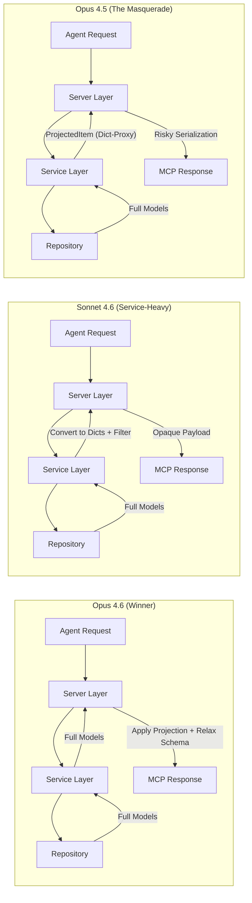

# Field Selection Review — Gemini

> [!important] Verdict
>
> - 🥇 **Opus 4.6** — production-grade; only implementation that solves both the feature and MCP schema constraints
> - 🥈 **Sonnet 4.6** — functional but loses schema introspection
> - 🥉 **Opus 4.5** — clever but brittle; `ProjectedItem` dict-proxy breaks Pydantic expectations

> [!note] Naming
>
> - Opus 4.6 = `agent-1edcddf2`, Sonnet 4.6 = `agent-904b6be1`, Opus 4.5 = `agent-878a38d0`
> - Branches: `claude-model-comparison-field-selection/<model>`

## Why Opus 4.6 Won

- ✅ **Architectural purity** — projection as a **presentation concern** (server layer), not business logic (service layer)
- ✅ **MCP schema safety** — only implementation that solves the "required field" paradox in MCP tool definitions
- ✅ **Superior DX** — warnings instead of hard errors, accepts both `snake_case` and `camelCase`
- ✅ **Bulletproof testing** — consistency checks ensure projection logic stays in sync with model changes

## Architecture Comparison



| Dimension | 🥈 Sonnet 4.6 | 🥇 Opus 4.6 | 🥉 Opus 4.5 |
|---|---|---|---|
| **Filtering layer** | Service | ✅ **Server (correct)** | Service |
| **Output type** | `dict[str, Any]` | ✅ `Task`/`Project` (typed) | `ProjectedItem` (hacky) |
| **MCP schema** | Broken (no docs) | ✅ Fixed (dynamic schema) | Broken (validation risk) |
| **Unknown fields** | Hard error | ✅ Warning (best UX) | Log warning only |
| **Default fields** | Minimal set | ✅ Minimal set | All fields |

## The Winning Edge — Dynamic Schema

The MCP protocol validates tool outputs against JSON Schema. If a tool declares `name` as required but the agent only requests `id`, the SDK throws a validation error.

Opus 4.6 solves this by relaxing the schema at registration time:

```python
def build_projected_schema(item_type: type) -> dict[str, Any]:
    schema = ListResult[item_type].model_json_schema()
    defs = schema.get("$defs", {})
    if item_type.__name__ in defs:
        defs[item_type.__name__]["required"] = ["id"]
    return schema
```

- Agent still sees documentation for **all** fields
- Protocol allows returning **any subset**
- => Type introspection preserved, validation errors eliminated

## Why the Others Fell Short

### 🥈 Sonnet 4.6

- ❌ **Blind responses** — `dict[str, Any]` return means agents lose MCP introspection
- ⚠️ **Service bloat** — service now cares about serialization aliases and field names (server's concern)

### 🥉 Opus 4.5

- ❌ **The "Masquerade" risk** — `ProjectedItem` inherits from `dict` with `__getattr__`
  - Brittle — any code expecting a Pydantic `BaseModel` (like middleware) will crash
- ⚠️ **Opt-in only** — doesn't reduce payload by default, missing the performance win

## Example

**Input:**

```json
{ "search": "Milk", "fields": ["name", "due_date"], "exclude_null": true }
```

**Output:**

```json
{
  "items": [{ "id": "t1", "name": "Buy Milk", "dueDate": "2024-04-13T17:00:00Z" }],
  "total": 1, "hasMore": false
}
```

- `id` automatically included
- `due_date` → correctly mapped to `dueDate` alias
