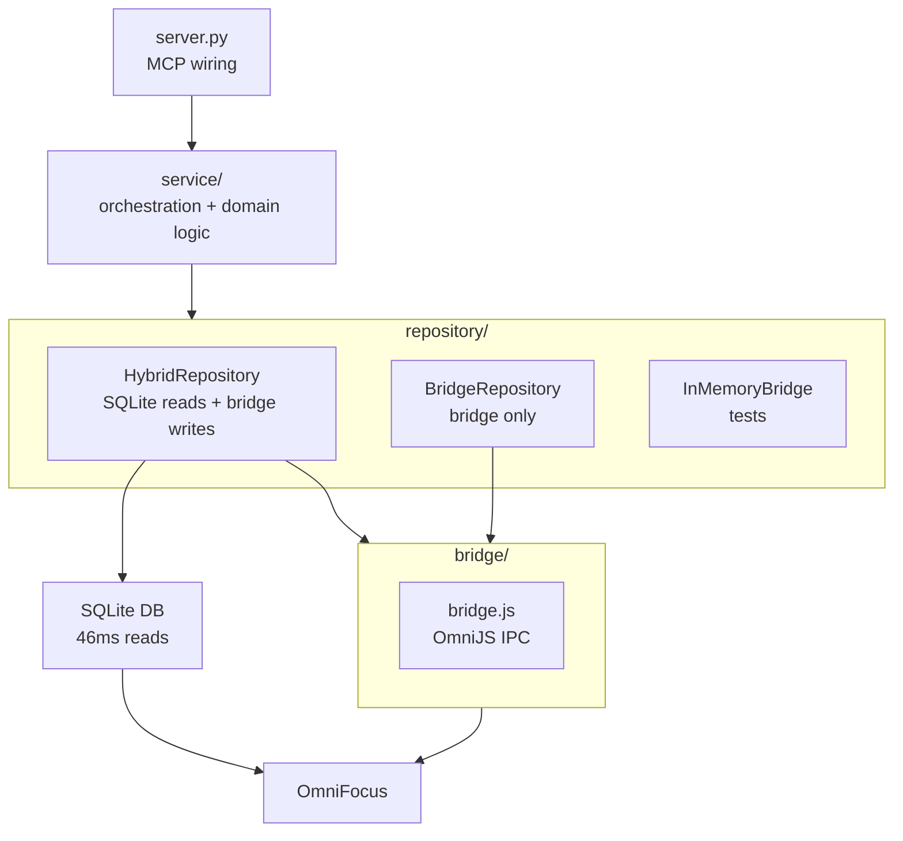
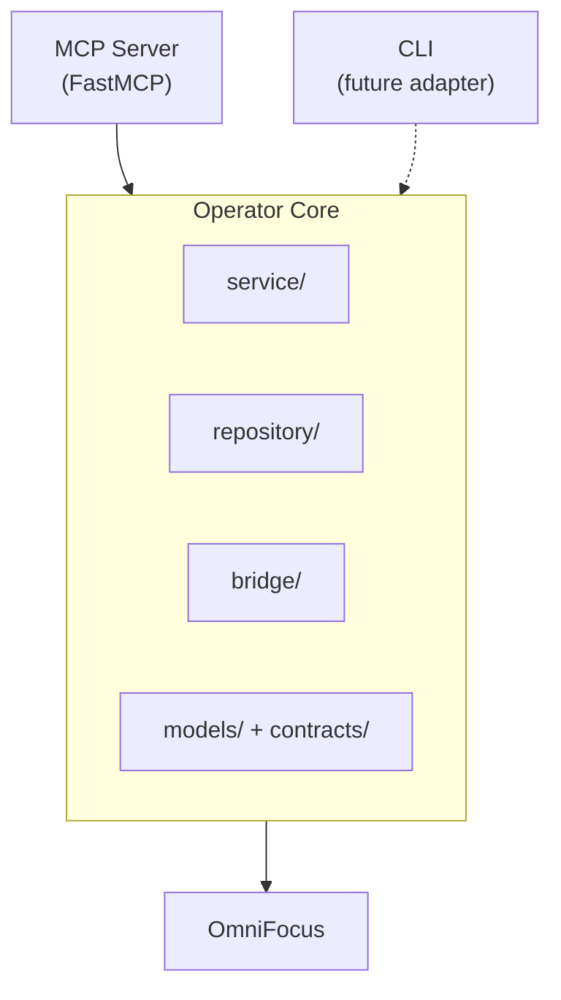
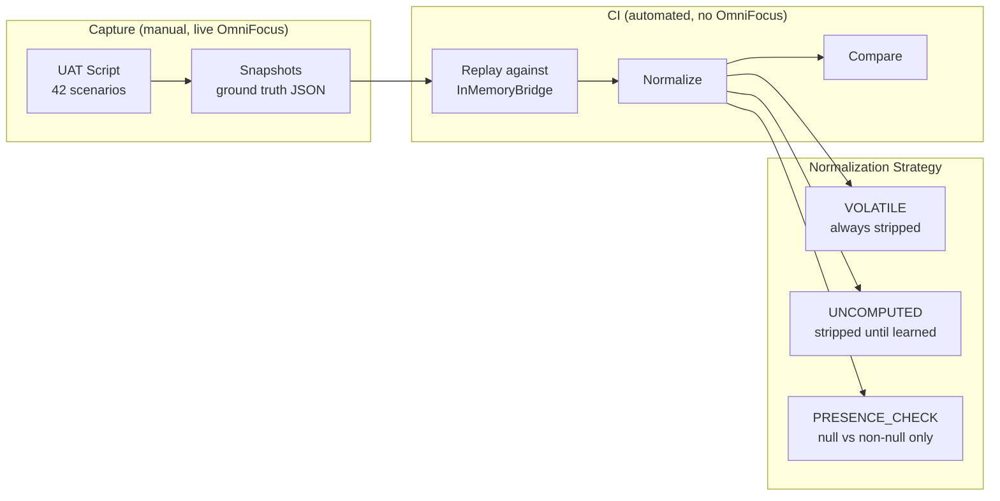

# Codebase Showcase — What Makes OmniFocus Operator Impressive

Source material for portfolio showcase — technical depth, failure stories, and design principles. Evidence-based, with file paths and code examples.

---

## The Problem

No API. OmniFocus is a macOS desktop app with a proprietary scripting runtime (OmniJS). The only programmatic interface: JavaScript snippets executed inside OmniFocus via IPC — a stdin/stdout bridge to a process you don't control, running in someone else's runtime, with undocumented quirks and no test environment.

AI agents need structured, typed, reliable tool interfaces. OmniFocus offers none of that. No headless mode, no test instance, no way to run automated tests against the real app in CI. The only OmniFocus environment is the user's live task database.

This project bridges that gap: turns a closed desktop app into structured task infrastructure that AI agents can call reliably. Everything below — the architecture, the testing strategy, the agent experience design — is a response to this constraint.

---

## 1. Architecture & Systems Design

### Three-Layer Architecture That Earns Its Keep

The architecture isn't decoration — each layer exists because it handles genuinely different concerns:

- **Server** (`server.py`, 316 lines) — MCP protocol wiring, tool annotations, lifespan management. Deferred imports enable graceful degradation.
- **Service** (`service/`, 5 modules) — Orchestration, validation, resolution, domain logic, payload construction. Thin orchestrator delegates to extracted modules.
- **Repository** (`repository/`) — Data access with three pluggable implementations: HybridRepository (SQLite + bridge, 46ms reads), BridgeRepository (fallback), InMemoryBridge (tests).



**Why it matters:** A skeptical tech lead would expect this to be over-engineered for 6 tools. It's not — the complexity is *localized* to where it's needed (bridge adapter, SQLite reader, domain logic) and *absent* where it would hurt (the service orchestrator is genuinely thin).

### Framework-Agnostic by Design



Exactly **2 MCP imports** in the entire codebase — both in `server.py`. Service, repository, bridge, models, contracts: none of them know MCP exists.

`server.py` is pure wiring: tool registration, lifespan management, error-to-response conversion. Zero business logic. Adding a CLI means writing another ~300-line adapter that calls the same `OperatorService`. Same domain logic, same validation, same repository. The MCP layer is a thin shell around a framework-independent core.

### "Dumb Bridge, Smart Python"

The bridge (`bridge.js`, ~400 lines) is intentionally minimal: enum resolution, file I/O, one-liner entity mappers. All business logic lives in Python (14,000 lines), typed, tested, validated.

**Why this design:**
- OmniJS freezes the UI — every line is user-visible latency
- OmniJS is brittle — unreliable batch operations, opaque enums
- Python is testable — 668 tests, 98% coverage
- Python is typed — Pydantic models, strict mypy

**Consequence for change:** If OmniFocus changes behavior, the fix is: update bridge enum resolvers (~5 lines) → update adapter if needed → update domain logic if intent changes. Service layer doesn't care *how* the bridge works.

**Not guessed — researched.** The bridge design was informed by 27 OmniJS audit scripts that mapped real OmniFocus behavior (enum semantics, edge cases, API quirks) and 6 structured deep dives before architecture was finalized. The "dumb bridge" constraint is evidence-based, not aesthetic.

**Known OmniJS quirks that drive this design:**

| Quirk | Workaround |
|-------|------------|
| `removeTags(array)` is unreliable | Bridge removes tags one at a time in a loop |
| `note = null` is rejected | Service maps `null → ""` before building payload |
| Enums are opaque objects (`.name` returns `undefined`) | Bridge does minimal enum-to-string resolution, throws on unknowns |
| Same-container moves are silent no-ops | Service detects and warns with `before`/`after` workaround |
| Blocking state is invisible to OmniJS | Only SQLite has full availability data (see Capability Degradation) |

### Method Object Pipeline Pattern

Write operations use Method Objects — `_AddTaskPipeline` and `_EditTaskPipeline` encapsulate multi-step workflows:

```python
async def execute(self, command: EditTaskCommand) -> EditTaskResult:
    await self._verify_task_exists()
    self._validate_and_normalize()
    self._resolve_actions()
    self._apply_lifecycle()
    self._check_completed_status()
    await self._apply_tag_diff()
    await self._apply_move()
    self._build_payload()
    if (early := self._detect_noop()) is not None:
        return early
    return await self._delegate()
```

Each step is named, testable, shows up in stack traces. Pipelines are created, executed, and discarded in a single call — mutable state on `self` is safe.

**Not a one-off trick — an enforced convention.** Documented in `CLAUDE.md` and `architecture.md`. Every write operation follows it. This was elevated from occasional pattern to architectural standard through conviction — it faced pushback during development but proved its value in readability and debuggability.

Both `add_tasks` and `edit_tasks` follow identical structural patterns at every boundary: Command → RepoPayload → RepoResult → Result. The convention isn't just per-operation consistency — it's cross-operation predictability.

### Graceful Degradation via ErrorOperatorService

When startup fails (missing database, unreachable OmniFocus), the server stays alive:

```python
except Exception as exc:
    error_service = ErrorOperatorService(exc)
    yield {"service": error_service}
```

`ErrorOperatorService` raises the startup error on any attribute access. Claude Desktop keeps the connection open; the agent sees exactly why startup failed, not a crash. This is graceful degradation through type boundaries.

### Graceful Capability Degradation

The repository layer has two implementations, selected explicitly via `OMNIFOCUS_REPOSITORY` env var:

- **HybridRepository** (default) — reads from SQLite (46ms), writes via bridge. Full two-axis status resolution including "blocked" availability.
- **BridgeRepository** (bridge-only) — all operations via bridge (~500ms). Loses "blocked" detection.

Why "blocked" requires SQLite: OmniFocus's `blocked` column captures cross-task state — sequential positioning, future defer dates, parent blocking, OnHold tags. This is relational reasoning across the task graph. OmniJS can't compute it without scanning every task, so the bridge enum has a "Blocked" value but **never sends it**.

No silent failover — explicit env var, factory warns on startup when running degraded. The agent sees the same two-axis model either way; one axis just has fewer possible values.

---

## 2. Agent Experience Design

The user of this system is an AI agent. Agents can't browse documentation, can't ask clarifying questions mid-operation, can't undo mistakes, can't open a second tab. Every piece of information they need must be in the request schema, the response payload, or the error message. This constraint drove design decisions across every layer of the system.

### Design From What Agents Need, Not What the Source Provides

OmniFocus stores task state in a single `taskStatus` field: `Available`, `Blocked`, `DueSoon`, `Overdue`, `Completed`, `Dropped`. The path of least resistance — and what most developers would do — is expose that single field. Maybe add a docstring explaining what each value means.

Instead, this project decomposes it into two independent axes: **urgency** (time pressure: `overdue | due_soon | none`) and **availability** (work readiness: `available | blocked | completed | dropped`). A task can be "available and overdue" (work on this NOW) vs "blocked and due_soon" (waiting, will be urgent soon). The single-field status loses this distinction — an agent would have to reverse-engineer the components every time.

This is the hardest kind of design decision: it adds complexity to the adapter layer so the agent doesn't have to think. The adapter absorbs the translation; the agent sees a clean, two-dimensional model. The complexity is invisible to the user — which is exactly what good product design looks like.

This principle — design from what the user needs, not from what the source provides — runs through the entire system. The technical implementation is detailed in Section 5; the point here is the *design instinct* behind it.

### Responses That Teach

Every write response includes a `warnings` array — operations succeed but surface caveats the agent needs to know:

- **Status awareness:** Editing a completed task? Warning tells the agent and asks it to confirm with the user.
- **API limitations:** Moving to the same container? Warning explains the OmniFocus API limitation and suggests a workaround (use `before`/`after` instead).
- **Lifecycle surprises:** Completing a repeating task? Warning explains that this occurrence completed and a new one was created — non-obvious behavior the agent needs to understand.
- **Redundancy detection:** Adding a tag that's already present? Warning names the tag and its ID so the agent can adjust.

Warnings are the agent's learning signal. An agent evaluating them with "beginner's mind" takes the correct action without needing to read documentation or source code. The warning text IS the documentation.

All messages are centralized in `agent_messages/` — parameterized format strings, enforced by AST-based tests that prevent inline strings from sneaking into service code (see Section 4).

### Errors That Guide

Error messages include four components: what went wrong, why it matters, how to fix it, and what the tradeoff is. (See the SQLite error example in Section 6.)

Entity-specific errors ensure the agent knows exactly which field to fix:
- `TASK_NOT_FOUND` vs `PARENT_NOT_FOUND` vs `ANCHOR_TASK_NOT_FOUND` — different entities, different resolution paths
- `AMBIGUOUS_TAG` lists all matching IDs so the agent can disambiguate without a second round-trip
- `TAG_REPLACE_WITH_ADD_REMOVE` explains the mutual exclusivity constraint, not just "invalid input"

### Validation as Agent Protection

Write models use `extra="forbid"` — an agent that sends `tag` instead of `tags` gets an immediate, specific error naming the unknown field. Read models use `extra="ignore"` for forward compatibility (new bridge fields don't break older agents).

Batch limit is checked before validation — the agent sees "exactly 1 item per call" instead of a confusing validation failure on item #2. Model validators prevent conflicting intent: can't use `replace` with `add`/`remove` on tags, `moveTo` must have exactly one position key. Invalid states are unrepresentable, not just undocumented.

### Tool Descriptions as the Only Documentation

MCP tool descriptions are the agent's entire reference. They're not brief — they include field-by-field parameter guides, explicit constraints ("currently limited to 1 item per call"), patch semantics cheat sheets (omit = no change, null = clear, value = update), and warnings about unsupported features ("Repetition rules, notifications, and sequential/parallel settings are not yet available").

Tool annotations (`ToolAnnotations`) signal the safety profile of each operation: `readOnlyHint=True` on reads, `destructiveHint=False` on writes (creates/modifies, never deletes). Agents and MCP clients use these hints to decide which tools are safe to call without user confirmation.

### No-Op Detection

When an edit wouldn't change anything, the system returns early with guidance instead of making a pointless bridge call. Two distinct messages for two distinct root causes:
- **"No changes specified"** — agent sent an edit request but omitted all fields (forgot to include them)
- **"No changes detected"** — agent's values match the task's current state (nothing to do)

Different root causes, different guidance. The agent learns the distinction. And because the bridge call is skipped entirely, it's also a performance win.

### Deliberate Omissions as Design

What the system doesn't do is as intentional as what it does:

- **No dry-run/preview** — agent commits to an operation or doesn't. No guess-and-check workflow that would double the API surface.
- **No undo** — agent calls edit again to reverse. Consequence awareness is built into the interaction model.
- **No interactive confirmation** — all decisions are made upfront in the request payload. The agent is trusted to have already consulted the user.
- **No summary/lightweight mode** — agent always gets the full entity with all fields. No mode to forget about, no partial data to misinterpret.

These aren't missing features — they keep the API surface small, predictable, and unambiguous. An agent learning this system has fewer modes to discover and fewer ways to get confused.

---

## 3. Type System & API Design

### Three-Way Patch Semantics

The API distinguishes three states for every field: **omitted** (no change), **null** (clear the value), and **set** (update). An internal `UNSET` sentinel handles this at the type level — invisible in JSON schema, agents never see it.

### Type Aliases That Encode Domain Intent

```python
Patch[T] = Union[T, _Unset]              # Set or omit. Cannot clear.
PatchOrClear[T] = Union[T, None, _Unset] # Set, clear, or omit.
PatchOrNone[T] = Union[T, None, _Unset]  # Same union, but None is meaningful data.
```

`PatchOrClear` and `PatchOrNone` are **identical unions with different names**. The name signals intent: `note: PatchOrClear[str]` means None=clear. `MoveAction.ending: PatchOrNone[str]` means None=inbox (a location, not an absence).

Tests verify JSON schema is byte-for-byte identical before and after alias migration. Additional tests ensure alias names don't leak into `$defs`.

### Four-Layer Type Flow

Every write operation has 4 distinct model types:

1. **Command** (agent → service): `AddTaskCommand` — raw agent input, tag *names*
2. **RepoPayload** (service → repository): `AddTaskRepoPayload` — resolved, tag *IDs*
3. **RepoResult** (repo → service): `AddTaskRepoResult` — minimal bridge confirmation
4. **Result** (service → agent): `AddTaskResult` — enriched with warnings

The transformation is visible: you see exactly where names become IDs, where dates become ISO strings.

### Actions Block: Intent vs State

The edit API separates two fundamentally different kinds of operations:

- **Top-level fields** are idempotent setters — `name`, `note`, `dueDate`, `flagged`. Set a value or clear it. Order doesn't matter. No side effects.
- **Actions block** contains stateful operations — `tags` (add/remove/replace with per-tag warnings), `moveTo` (with cycle detection), `lifecycle` (complete/drop with repeating-task awareness). These have ordering, produce side effects, and interact with each other.

This separation prevents agents from confusing "set a field" with "perform an operation" — a distinction that most task APIs collapse.

This boundary evolved: tags started as a top-level field in v1.2, then migrated to the actions block in v1.2.1 when it became clear that tag operations produce side effects (per-tag warnings, diff computation). The API has a forward-thinking evolution path — new stateful operations join the actions block; simple setters stay top-level.

### Protocol-Driven Boundaries

Three protocols in one file (`contracts/protocols.py`):
- **Service** — agent-facing boundary (Commands in, Results out)
- **Repository** — service-facing boundary (RepoPayloads in, RepoResults out)
- **Bridge** — repository-facing boundary (raw dicts in, raw dicts out)

All `@runtime_checkable`. Structural subtyping enables test doubles without inheritance. `ErrorOperatorService` satisfies the same protocol as `OperatorService`.

---

## 4. Testing Strategy

### The Golden Master Contract Pattern (Most Novel)

The central testing challenge: how do you verify that your test double (InMemoryBridge) behaves like the real system (OmniFocus) when you can't run OmniFocus in CI?



1. **Capture** — UAT script (`uat/capture_golden_master.py`, 1230 lines) runs interactively against live OmniFocus. 42 scenarios across 7 categories. Human-guided, records operation + params + response + state_after as JSON snapshots.
2. **Replay** — Contract tests (`tests/test_bridge_contract.py`, 379 lines) load each snapshot, replay the operation against InMemoryBridge, compare output with normalization.
3. **Normalize** — Three-tier field stratification handles the reality that a test double can't perfectly match a live system:

| Tier | Fields | Treatment | Why |
|------|--------|-----------|-----|
| **VOLATILE** | id, url, timestamps | Always stripped | Different every run — random/time-dependent |
| **UNCOMPUTED** | status, effectiveDueDate | Stripped until InMemoryBridge learns | Bridge doesn't compute these *yet* |
| **PRESENCE_CHECK** | completionDate, dropDate | Normalized to `"<set>"` | Null-vs-non-null is deterministic; exact timestamp varies |

### The Ratchet: Tests That Get Stricter Automatically

UNCOMPUTED is a whitelist of fields InMemoryBridge doesn't compute yet. When InMemoryBridge learns to compute a field (e.g., `effectiveFlagged`), the fix is: remove it from the UNCOMPUTED list. That's it — one line deleted. The golden master comparison now includes that field automatically. Zero test code changes, zero snapshot updates. Tests just got stricter.

This means test infrastructure *compels* progress: every improvement to InMemoryBridge automatically tightens verification. The ratchet only moves in one direction.

### Four Testing Layers

| Layer | What it proves | Example |
|-------|---------------|---------|
| **Unit** | Models, enums, adapters, message constants | `test_models.py` (1087 lines), `test_warnings.py` (AST enforcement) |
| **Integration** | Repository + bridge, SQLite reads, WAL freshness | `test_hybrid_repository.py` (1664 lines) |
| **Service** | Business logic: lifecycle, tags, cycles, no-ops | `test_service.py` (1496 lines), `test_service_domain.py` |
| **E2E** | Full MCP protocol through in-process server | `test_server.py` (1164 lines, memory streams, no sockets) |

Each layer catches different failure modes. Unit → parsing bugs. Integration → caching bugs. Service → business logic bugs. E2E → protocol bugs.

### Two UAT Modes: Different Quality Axes

UAT itself is split by phase type — recognizing that "does it work" and "does it make sense to maintain" are different questions:

- **Feature phases:** UAT focuses on user-observable behavior — does the feature work as expected from the agent's perspective?
- **Refactoring phases:** UAT focuses on developer experience — package layout, naming conventions, import patterns, boundary signatures. The question is "does this make sense to the person who'll maintain it?"

### SAFE-01 Enforcement: Belt AND Suspenders

`RealBridge.__init__` checks `PYTEST_CURRENT_TEST` and refuses to instantiate during automated testing. Then a *second* test scans all test files to ensure no test removes that guard:

```python
def test_no_test_removes_pytest_current_test():
    pattern = re.compile(r"""(delenv|unsetenv)\s*\(\s*["']PYTEST_CURRENT_TEST["']""")
    violations: list[str] = []
    for py_file in tests_dir.rglob("*.py"):
        ...
    assert not violations
```

Paranoia codified into a test. Prevents accidental or deliberate circumvention.

### Marker-Driven Fixture Composition

Zero-boilerplate test setup via pytest markers:

```python
@pytest.mark.snapshot(tasks=[make_task_dict(id="t1", name="Urgent")])
async def test_something(service: OperatorService) -> None:
    result = await service.get_task("t1")
```

The chain `bridge → repo → service → server` is wired by conftest fixtures. Tests declare state via markers, not factory calls.

### Stateful Test Doubles: Why the Golden Master Works

The golden master pattern only works if the test double is faithful enough that behavioral equivalence testing is meaningful. InMemoryBridge isn't a stub or a mock — it's a **behavioral double** that implements real domain logic:

- **Full task lifecycle** — add, edit, complete, drop. Generates synthetic IDs, builds task dicts in raw bridge format (camelCase), resolves parent references.
- **Ancestor-chain inheritance** — `_compute_effective_field()` walks up the task→project hierarchy to compute `effectiveDueDate`, `effectiveFlagged`, matching real OmniFocus behavior.
- **Tag diff semantics** — add/remove/replace modes with the same set-based computation as the production service.
- **Parent flag synchronization** — `_set_has_children()` updates parent flags when tasks are added or moved, maintaining referential integrity.
- **Deep-copy isolation** — `get_all()` returns deep copies so tests can't leak side effects between scenarios.

Call tracking (`BridgeCall` records) and error injection (`set_error`/`clear_error`) round out the testing infrastructure. Tests exercise the same adapter paths as production because InMemoryBridge outputs raw bridge format, not pre-adapted models.

### AST-Based Message Enforcement

`test_warnings.py` uses AST parsing to verify all agent-facing messages come from centralized constants. No inline strings can sneak into service code. All constants are actual strings with balanced format placeholders.

---

## 5. Domain Modeling

### Two-Axis Status Model

OmniFocus stores state in a single `taskStatus` field. This project decomposes it into two independent axes:

- **Urgency** (time pressure): `overdue | due_soon | none`
- **Availability** (work readiness): `available | blocked | completed | dropped`

A task can be "available and overdue" (work on this NOW) vs "blocked and due_soon" (waiting, will be urgent). The single-field status loses this distinction.

The same two-axis model is populated by two completely different code paths: SQLite reads raw columns (`blocked`, `overdue`, `dueSoon`) through pure mapping functions; bridge reads OmniJS enum strings through dict lookup tables (`_TASK_STATUS_MAP`, `_PROJECT_STATUS_MAP`, `_TAG_AVAILABILITY_MAP`). Three entity-specific tables because tasks, projects, and tags each have different source semantics — but both paths produce identical domain models.

### Agent-First Design: Warnings > Errors

The domain logic doesn't block valid transitions — it returns warnings and lets agents decide:

- `LIFECYCLE_REPEATING_COMPLETE` — warns but doesn't prevent
- `TAG_ALREADY_ON_TASK` — warns but doesn't prevent
- `MOVE_SAME_CONTAINER` — warns with workaround
- `EDIT_COMPLETED_TASK` — warns, asks agent to confirm with user

Only genuine invariant violations are errors: circular references, entity not found, ambiguous tags.

This reflects a deep philosophy: **agents are intelligent and should see domain surprises before acting, not after failures.**

### Move Semantics: Inbox as First-Class Location

`MoveAction.ending = None` means "move to inbox" — a meaningful value, not "clear the field." The type alias `PatchOrNone` (not `PatchOrClear`) signals this distinction. Move logic handles four patterns: container moves (beginning/ending), anchor moves (before/after), inbox moves (None), with cycle detection preventing circular parent references.

### Tag Actions: Intent, Not State

`TagAction` models three operation modes (add, remove, replace) with a validator ensuring mutual exclusivity. Each mode computes a diff against current tags, producing granular per-tag warnings. The domain distinguishes between *intent* (what you want to do) and *result* (what tags end up on the task).

### Effective Fields and Inheritance

Models include both direct fields (`due_date`) and effective fields (`effective_due_date`) — tasks inherit dates from parent projects. InMemoryBridge implements ancestor-chain traversal to compute these, matching real OmniFocus behavior.

---

## 6. Code Craft

### Naming That Encodes Architecture

- Write models: `AddTaskCommand` → `AddTaskRepoPayload` → `AddTaskRepoResult` → `AddTaskResult` — the name tells you the layer, the boundary, the role.
- Read models: bare nouns — `Task`, `Project`, `Tag`. No suffix = entity.
- Pipelines: `_VerbNounPipeline` (private, single-use).
- Verb-first, not noun-first: `AddTaskCommand`, not `TaskAddCommand`. Matches tool verb.

### Mapping Tables Over Conditionals

Status adapter uses dict lookups, not if/elif chains:

```python
_TASK_STATUS_MAP: dict[str, tuple[str, str]] = {
    "Available": ("none", "available"),
    "Overdue": ("overdue", "available"),
    "Completed": ("none", "completed"),
    ...
}
```

Easier to audit (all values visible at once), scales without cognitive load. Pattern repeats throughout adapter and hybrid repository.

### Method Length and Cohesion

Most methods stay 10-20 lines. The three tag-operation methods (`_apply_add`, `_apply_remove`, `_apply_replace`) follow identical structure: assert type → resolve → check warnings → return (final_set, warns). A reviewer can scan one and predict the others.

### Zero Technical Debt Markers

- Zero `type: ignore` in production code (strict mypy)
- Zero commented-out code
- Zero TODO/FIXME/HACK markers
- Pragmatic escapes are annotated: `# noqa: PLC0415 — Intentional late import: graceful degradation`

### Error Messages That Teach

```python
"OmniFocus SQLite database not found at:\n"
"  {db_path}\n\n"
"To fix this:\n"
"  Set OMNIFOCUS_SQLITE_PATH to the correct database location.\n\n"
"As a temporary workaround:\n"
"  Set OMNIFOCUS_REPOSITORY=bridge-only to use the OmniJS bridge\n"
"  (slower, no 'blocked' availability)."
```

Not "File not found." An error that teaches: what went wrong, why it matters, how to fix it, what the tradeoff is.

---

## 7. Safety & Operations

### Failure Cascade Table

| Failure | Detection | Recovery |
|---------|-----------|----------|
| OmniFocus closed | Bridge timeout (10s) | `BridgeTimeoutError` → "Is OmniFocus running?" |
| Database missing | Factory validation | `ErrorOperatorService` serves diagnostic |
| Database corrupted | SQLite exception | Propagates; `ErrorOperatorService` handles |
| IPC dir inaccessible | Bridge instantiation | `BridgeConnectionError` → suggests bridge-only |
| Malformed response | `_validate_response()` | `BridgeProtocolError` with detail |
| Orphaned IPC files | Server startup | `sweep_orphaned_files()` cleans up |
| Write not persisted | WAL polling timeout | Logs warning, continues with possibly stale data |
| Circular move | Service layer | `ValueError` with explanation |
| Ambiguous tag | Resolver | `ValueError` listing all matching IDs |

### Write-Through Verification

After bridge writes, the `@_ensures_write_through` decorator polls SQLite WAL mtime to confirm OmniFocus persisted the change. Captures baseline mtime before the bridge call, polls at 50ms intervals, 2s timeout. If timeout occurs, logs a warning and continues with possibly stale data — doesn't crash, doesn't block.

This catches silent failures: the bridge says "OK" but nothing actually persisted. Most task systems trust the write response blindly. This one verifies at the filesystem level.

### Async-Safe I/O

All blocking operations wrapped in `asyncio.to_thread()`: IPC file writes, WAL polling, SQLite reads, orphan sweep. Single-threaded async server can't deadlock.

### Atomic IPC File Writes

Request files use tmp-then-rename pattern (`os.replace`) for atomicity. Response polling checks existence before reading. Cleanup uses `missing_ok=True` for robustness.

---

## 8. Developer Experience

### Discoverability: Navigate by `ls`

```
src/omnifocus_operator/
├── contracts/       ← boundaries only
├── models/          ← domain entities only
├── bridge/          ← OmniFocus IPC
├── repository/      ← data access + factory
├── service/         ← orchestration + business logic
├── agent_messages/  ← centralized error/warning text
└── server.py        ← MCP wiring
```

No `utils/`, no `helpers/`, no `core/`. Every package has a declared purpose. A new engineer understands the architecture from directory names alone.

### Documentation That Matches Code

`docs/architecture.md` (647 lines) has Mermaid diagrams, protocol signatures, write pipeline sequence diagram, and Method Object pattern explanation. Not aspirational — every diagram matches the actual code structure. The architecture doc was verified independently by the Skeptical Tech Lead reviewer.

### Three-Layer Validation

1. **Pydantic structural** — required fields, enum values, shape constraints, `extra="forbid"` rejects unknown fields
2. **Service semantic** — parent exists, tag names resolve, dates valid
3. **Domain logic** — cycle detection, no-op warnings, state transitions

Each layer has a purpose. Violations stop early. Errors propagate cleanly.

---

## 9. AI Conductor Process

### Contract-First Planning

Plans specify **what must be true**, not how to make it true:

```
truths:
  - "InMemoryBridge computes effectiveDueDate by walking ancestor chain"
  - "Presence-check normalization converts non-null timestamps to '<set>' sentinel"
```

This lets executor agents use any approach — the truth is the contract.

### Three-Role AI Orchestration

- **Autonomous** (`gsd:execute-phase`) — Plans are behavioral contracts, no human judgment needed mid-execution
- **Interactive** (`uat-regression`) — "You do NOT know the implementation. Do NOT read source code. Do NOT fix anything."
- **Collaborative** (human UAT, golden master capture) — "This is NOT a fully autonomous agent execution"

Different tools have different knowledge boundaries. A UAT agent reading implementation would work around bugs instead of surfacing them.

### Structured Feedback Loop

Patterns learned during development — what worked, what didn't, which approaches to repeat or avoid — persist into future sessions automatically. The human + AI team is a learning system: corrections and confirmations compound over time, so the same mistake is never made twice.

### Agent Roles as Epistemological Design

The three-role orchestration above is actually the surface of a deeper design principle: **what an agent is forbidden from knowing IS the design decision.**

Five custom agent skills built for this project, each with deliberately constrained knowledge:

- **UAT regression** (naive) — **forbidden from reading source code.** Can't see how features are implemented. Tests tool behavior with "beginner's mind" by calling MCP tools and evaluating responses. A UAT agent that reads implementation would work *around* bugs instead of *surfacing* them — the ignorance is the value.
- **Ground truth auditor** (thorough) — **forbidden from skipping edge cases.** Must verify every scenario in the golden master, not sample. Ensures the normalization tiers are correctly applied and no scenario is silently passing.
- **Coverage auditor** (skeptical) — **forbidden from crossing layer boundaries.** Can't mark a unit test as covering a service-level behavior. Respects the four testing layers (unit/integration/service/E2E) as distinct domains.
- **Suite updater** (constructive) — **forbidden from inventing scenarios.** Must research the actual feature before writing tests. Can't create test cases without evidence from the codebase or documentation.
- **Executor** (autonomous) — **forbidden from requesting human judgment mid-flight.** Plans are behavioral contracts ("these truths must hold"). Deviations from the plan are flagged, not silently resolved.

The constraint is the feature. Each role's knowledge boundary — what it knows, what it's forbidden from knowing — determines its value. An agent without the right constraints is just a fast typist.

---

## 10. What Went Wrong — And What I Learned

The architecture and testing visible in this codebase weren't designed in a vacuum. They're the result of things going wrong and being corrected — and each failure produced a design principle to prevent recurrence.

### Story 1: The Silent Technical Debt Crisis (v1.0 → v1.2 → v1.2.1)

**The first warning (v1.0):** The pattern appeared from day one. During the foundation milestone, agents built the entire system against a bridge script that didn't actually work with real OmniFocus — discovered during UAT when the system was run against the real app and nothing happened. Resolving that incident produced 25+ audit scripts mapping real OmniFocus behavior and a three-reviewer spec validation pattern (senior dev, junior dev, product owner reviewing every important spec). The specs got bulletproof. But as v1.2 would show, bulletproof specs don't prevent architectural decay.

**The crisis (v1.2):** During milestone v1.2 (write operations), autonomous agents planned, discussed, and executed features. The specs were thorough. The tests were comprehensive — including UAT run by a dedicated agent. Everything was green.

Near the end of v1.2, a missed scope item (repetition rules) required inserting a new phase. Normal project management. But when agents tried to implement it, they kept getting confused about where to put the logic. That's when the engineer looked at the production code for the first time.

**What he found:** The create-task flow and edit-task flow were completely asymmetric. On the create path, a `TaskCreateSpec` object was created in the MCP server layer and leaked all the way down through the service to the repository — a presentation-layer concern traveling through every architectural boundary. On the edit path, the opposite: the service calculated bridge-ready payloads (the format the JavaScript bridge expects) and passed them to the repository, which just forwarded them — the bridge's internal implementation details leaking upward. One side leaked down, the other leaked up. The 669-line service file was a monolith mixing responsibilities that should have been separated.

> "I realised I hadn't even been looking at the code at all. I'd trusted the requirements and the tests."

**The key insight — silent technical debt:** In a human team, technical debt is never truly silent. A team member says "this is getting hard to work with." A PR reviewer flags a structural concern. Someone in standup mentions a task took longer than expected. You might choose not to address it, but you always *know*.

Agents never complain. They never say "this is getting messy." They never push back on architecture. If the cleanest path is hard to find, they find a messier path and ship it. The tests pass. The features work. The debt accumulates invisibly.

> "The technical debt was silent, because agents never complain. In a team setting, you may have technical debt, but you always know because a team member will tell you and you can decide what to do. In the agent setting, the agent just does it."

> "If they had asked me the correct question, I had the answer. It's just that I was never asked."

**The decision:** Full stop. Not "fix it later" — a dedicated cleanup milestone (v1.2.1). The initial scope was 5 phases. As each layer of cleanup revealed more problems underneath, it grew to 11 phases. Service decomposition into 5 focused modules. Simulator bridge access restrictions. Test double relocation. Type system cleanup. In-memory bridge restructuring. Golden master testing. Nearly as much work as the original feature implementation.

> "We could have kept pushing, but that's the recipe for disaster — after repetition rules, good luck trying to add more and more."

**What changed:** Not just the code — the design philosophy. The v1.2.1 cleanup didn't just fix the immediate mess; it produced the architectural principle that prevents it from recurring (see "Path of Least Resistance" below).

### Story 2: The Assumptions in the Test Double (v1.2.1)

During the v1.2.1 refactoring, another instance of the same pattern surfaced — quieter, but with deeper implications.

The in-memory bridge (the test double that simulates OmniFocus for automated testing) had been accumulating OmniFocus simulation logic — lifecycle behavior, field inheritance, status computation — over the course of multiple milestones. Agents had built up this logic silently, making assumptions about how OmniFocus behaves without flagging them. Same pattern as Story 1: agents found paths that worked, tests passed, and the assumptions went unquestioned.

This raised a concern: if the test double was built on unverified assumptions about OmniFocus behavior, every test built on top of it was testing against a fiction. How many of those assumptions were wrong?

That concern motivated the golden master approach (detailed in Section 4): capture real OmniFocus behavior, replay it against the in-memory bridge, fix any divergence. The golden master immediately validated the concern — the in-memory bridge had no ancestor-chain walk for effective field inheritance. In OmniFocus, setting a due date on a project causes child tasks to inherit that deadline as their `effectiveDueDate`. The test double returned `null`. It simply didn't implement inheritance.

**The production risk:** The v1.3.1 spec plans date filtering on `effectiveDueDate` (inherited values). Without the golden master fix, date filters would silently miss tasks with inherited deadlines — tests green, product broken.

The golden master wasn't a testing innovation pursued for its own sake. It was built because agents had made assumptions that turned out to hide behavioral gaps — and the only way to know how many gaps was to verify against reality.

### Design Principle: Path of Least Resistance

The overarching lesson from v1.2 and v1.2.1: **design architecture where the path of least resistance is the correct path.** Don't rely on discipline or documentation to prevent corner-cutting — make the structure itself guide agents toward the right decision.

**Concrete example:** Separate result types per operation (`CreateTaskRepoResult`, `EditTaskRepoResult`) instead of a shared `WriteResult`. The fields are identical today. A traditional engineering argument would call this unnecessary duplication.

But with agents, the calculus flips:

- **Duplication is cheap.** Agents don't get bored maintaining four similar classes. They don't forget to update one of them.
- **Wrong abstraction is expensive.** When those types inevitably diverge, separate types means "add a field to the right type." A shared type means a design decision — exactly the kind agents get wrong, because they lack the context to know when a shared abstraction should split.

> "Duplication is cheap, but a wrong abstraction is expensive — especially when the thing making decisions doesn't have the context to know it's wrong."

This principle has established names: "pit of success" in .NET, poka-yoke in Toyota manufacturing, desire paths in urban planning. Different domains, same insight: don't fight nature — design around it. The architectural quality visible in the current codebase isn't despite the failures — it's *because* of them.

### Spec Quality ≠ Architectural Quality

After the v1.0 phantom bridge incident, spec validation was strengthened: three specialized review agents (senior developer for technical gaps, junior developer for unclear requirements, product owner for product misalignment) review every important spec before execution.

This caught real gaps. But even with bulletproof specs, the v1.2 crisis still happened. The spec solved the *what* — features were correct, UAT passed. But the spec didn't cover the *how* — internal architecture. Agents self-organized the internals, and they organized them badly.

> "The spec was super defined, and the UAT was like magic — I let the agent run for half an hour, later I come back, and the feature is just working. But the spec didn't cover the underlying architecture."

**Two separate problems.** Solving one doesn't solve the other. A spec tells agents what to build; architecture tells them *where to put it*. Both need explicit guidance.

---

## 11. Taste & Restraint: What's NOT Built

The previous career handover assessment said: *"The project has taste. That is the word that best captures it."*

Evidence of restraint:

- **Single runtime dependency** (`mcp>=1.26.0`). No logging frameworks, no config libraries, no ORM. Uses stdlib: asyncio, sqlite3, pathlib, plistlib, zoneinfo.
- **No custom exception hierarchy.** Standard Python exceptions (ValueError, RuntimeError). Refine when patterns emerge.
- **No task reactivation, tag writes, folder writes, undo/dry-run.** Explicitly out of scope, not "we'll build it eventually."
- **Batch limit intentionally 1.** Clear error message for violations. Expand later when demand justifies it.
- **Zero TODO/FIXME/HACK in production code.** Code doesn't promise to fix things later — it's fixed now.
- **Read operations are one-liner pass-throughs, not pipelines.** Complexity only where it's needed.
- **Six features deliberately rejected** with documented rationale — task reactivation (OmniJS API unreliable), tag writes (out of scope for v1.2), folder writes, undo/dry-run, summary mode, automatic failover. Each has a written reason in DISCARDED-IDEAS.md. Saying no is a design decision.

---

## 12. The Numbers

| Metric | Value | Significance |
|--------|-------|-------------|
| Production code | 4,912 LOC | Lean, well-scoped |
| Test code | ~10,000 LOC | 2:1 test-to-code ratio |
| Tests | 668 | Behavioral, not padding |
| Coverage | 98% | Comprehensive |
| Golden master scenarios | 42 (7 categories) | Real behavior validation |
| Runtime dependencies | 1 | Intentional minimalism |
| mypy errors | 0 | Strict enforcement |
| type: ignore annotations | 0 | Zero escape hatches |
| Read latency | 46ms | 30-60x faster than bridge |
| Bridge JS tests | 71 | Right ratio for a relay layer |

---

## 13. Honest Self-Assessment

### What This Project Does NOT Demonstrate

**People and organizational skills (entirely absent):**
- Stakeholder management and balancing competing priorities
- Cross-team collaboration and managing inter-team tension
- Mentoring and leading other engineers
- Creating psychological safety — making sure other teams don't feel dismissed, while the team feels protected
- Working under real external deadlines and pressure

**Operational expertise (entirely absent):**
- Deployment and production operations
- Horizontal scaling and distributed systems
- Production-grade logging, observability, and distributed tracing

This is a single-user, locally-running application built by one person, for himself, with no external deadlines. It demonstrates architectural and engineering craft. It does not demonstrate the ability to navigate organizations, lead people, or operate production systems at scale.

