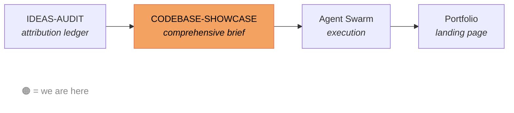

# Portfolio Deep Dive

Source material for building a portfolio landing page. These documents are consumed by an agent swarm to produce the final deliverable — no human reads the markdown directly.

## Files

- **CODEBASE-SHOWCASE.md** — Primary input for the agent swarm. Technical and product showcase across 12 sections: architecture, agent experience design, type system, testing, domain modeling, code craft, safety, developer experience, AI conductor process, taste & restraint, metrics, and independent validation. Updated as the project evolves.

- **IDEAS-AUDIT.md** — Attribution ledger: 145 decisions tagged by origin (🙋 human, 🤖 AI, 🤝 collaborative, ⚙️ framework, ✅ obvious, 🥷 external). Personal reference for the author. Informs what to emphasize in the showcase — not consumed directly by the agent swarm.

## Pipeline

