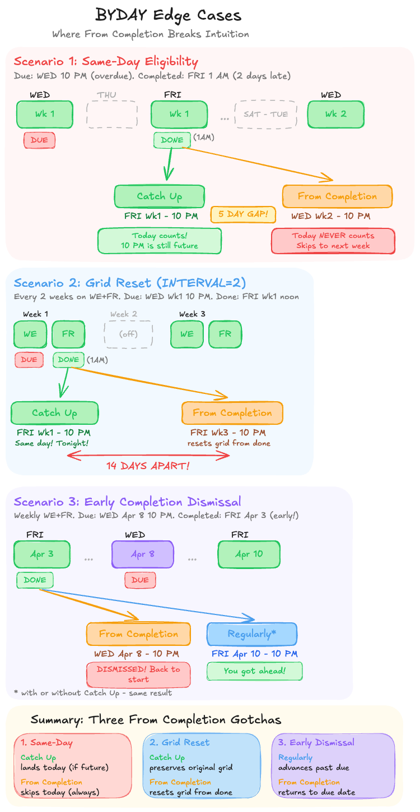
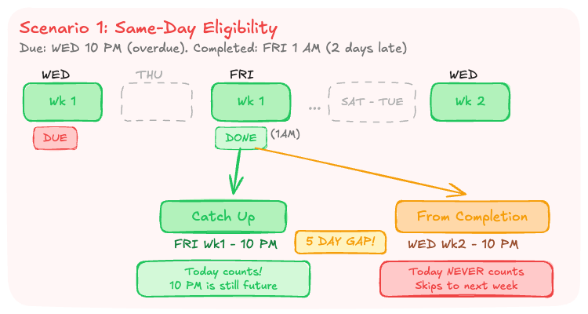
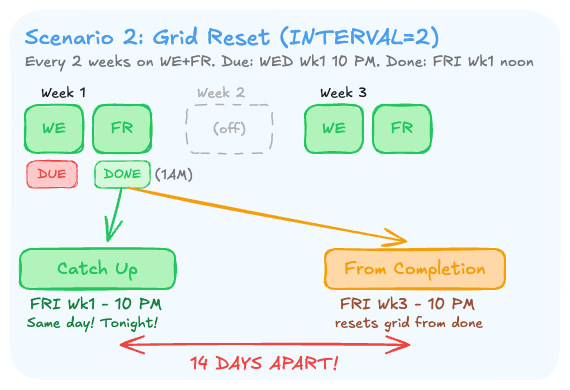
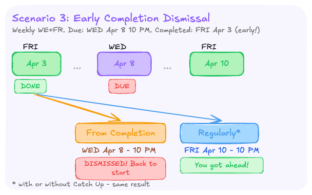

# BYDAY Edge Cases: Where From Completion Breaks Intuition

When a repeating task uses BYDAY patterns (e.g. weekly on WE+FR), the three OmniFocus schedule types — Regularly, Regularly with Catch Up, and From Completion — usually produce similar results. But there are three edge cases where From Completion behaves counterintuitively. 🫠

All findings were empirically verified on OmniFocus 4.7+ in April 2026. For the full research reference, see `omnifocus-repetition-behavior.md`.

---

## Scenario 1: Same-Day Eligibility

### Setup

- Task: repeat weekly on **WE + FR**, due **WED 10 PM** (overdue)
- Completed: **FRI 1 AM** (2 days late)
- Today (FRI) is a BYDAY match, and 10 PM is still 21 hours away

### Results

| Mode | Next due |
|------|----------|
| ✅ **Catch Up** | **FRI Wk 1, 10 PM** |
| ❌ **From Completion** | **WED Wk 2, 10 PM** |

### Why — ⚡ 5 day gap

- **Catch Up** checks at the **time level**
  - *"Is FRI 10 PM still in the future? Yes → land there"*
  - ✅ Lands on today
- **From Completion** checks at the **day level**
  - *"The completion day itself never counts as a valid next occurrence"*
  - ❌ Skips today entirely, no matter how many hours are left
- 🔑 This is the fundamental asymmetry between the two modes

---

## Scenario 2: Grid Reset (INTERVAL=2)

### Setup

- Task: repeat every **2 weeks on WE + FR**, due **WED Wk 1, 10 PM** (overdue)
- Completed: **FRI Wk 1, noon** (same on-grid week, 2 days late)

### Results

| Mode | Next due |
|------|----------|
| ✅ **Catch Up** | **FRI Wk 1, 10 PM** |
| ❌ **From Completion** | **FRI Wk 3, 10 PM** |

### Why — 🤯 14 day gap

- **Catch Up** preserves the original biweekly grid
  - → **FRI Wk 1, 10 PM**
    - FRI Wk 1 is on-grid, 10 PM is still future at noon → lands there
  - ✅ Stays on the original alternating-week schedule
- **From Completion** resets the grid from the completion date
  - → **FRI Wk 3, 10 PM**
    - Applies a full 2-week interval from FRI Wk 1
    - Then finds the next match
  - ❌ Completely new grid
- 🤔 The Catch Up result can feel surprising
  - *Due again tonight?!*
  - But it's correct: Wk 1 is on-grid, FRI is a match day, and 10 PM hasn't passed

---

## Scenario 3: Early Completion Dismissal

### Setup

- Task: repeat weekly on **WE + FR**, due **WED Apr 8, 10 PM**
- Completed: **FRI Apr 3** (5 days early! 🏃)

### Results

| Mode | Next due |
|------|----------|
| ✅ **Regularly*** | **FRI Apr 10, 10 PM** |
| ❌ **From Completion** | **WED Apr 8, 10 PM** |

*\* With or without Catch Up — same result.*

### Why — 😤 effort dismissed

- **Regularly** advances from the scheduled WED Apr 8 to the next BYDAY match
  - → **FRI Apr 10, 10 PM**
  - ✅ You got ahead!
- **From Completion** searches forward from the completion date (FRI Apr 3)
  - → **WED Apr 8, 10 PM**
    - Finds the next BYDAY match after FRI Apr 3
    - ...which is the original due date
  - ❌ Right back where you started — effort dismissed

---

## When to use which mode

- ✅ **Catch Up** (recommended default): best for tasks tied to specific calendar days. Skips past missed occurrences, lands on the nearest future grid point, preserves the original schedule grid. Predictable.
- ⚠️ **From Completion**: best when the *minimum gap* between occurrences matters more than the specific day (e.g. "water plants every 10 days"). Be cautious with BYDAY — the three edge cases above all produce surprising results.
- 🔄 **Regularly (no catch-up)**: use when you need to process every missed occurrence individually.