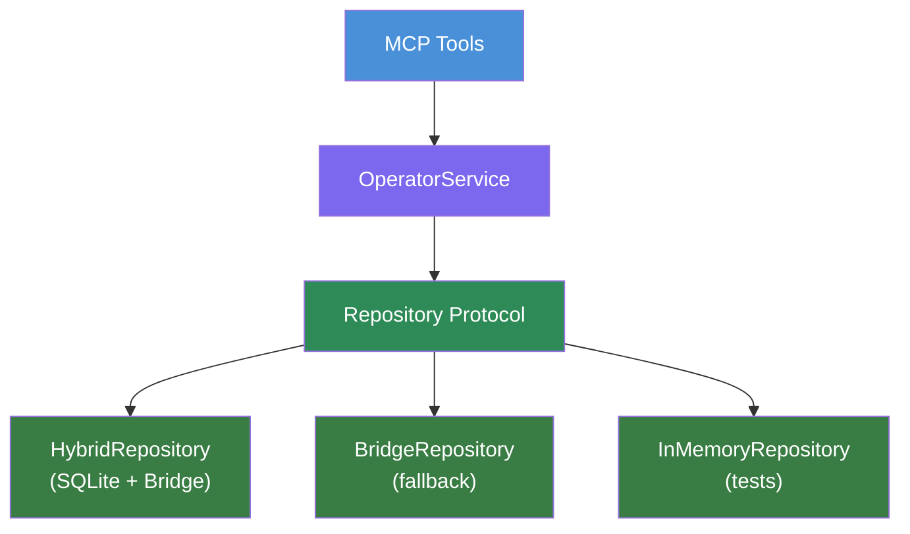

<div align="center">

# OmniFocus Operator

### The OmniFocus MCP server that your AI agent can actually depend on.

*Your tasks deserve a bridge that won't break under pressure.*
*OmniFocus, meet your AI-native interface.*

Production-grade MCP server. 46ms reads. 534 tests. Agent-first design.


```bash
pipx install git+https://github.com/HelloThisIsFlo/omnifocus-operator.git
```

</div>

---

<div align="center">

`534 tests` · `94% coverage` · `46ms reads` · `1 dependency` · `3-layer architecture`

</div>

---

## 😤 The Problem

You searched for an OmniFocus MCP server. You found dozens. You tried one — maybe two.

The first one took 3 seconds to return your tasks. The second one crashed silently when OmniFocus wasn't running. The third one worked fine until your agent tried to edit a task and got back... nothing. No error. No feedback. Just silence and a broken conversation.

These projects are thin AppleScript wrappers. Flat scripts with no test coverage, no error handling, no awareness that an AI agent is on the other end. They work for demos. They break when you depend on them.

OmniFocus is where your work lives. The bridge to it deserves the same care.

---

## 🏁 How It Works

**1. Install** — One command. No configuration files. No environment variables.
```bash
pipx install git+https://github.com/HelloThisIsFlo/omnifocus-operator.git
```

**2. Configure Claude Desktop** — Paste this into `~/Library/Application Support/Claude/claude_desktop_config.json`:
```json
{
  "mcpServers": {
    "omnifocus": {
      "command": "omnifocus-operator"
    }
  }
}
```

**3. Ask Claude** — "Show me my OmniFocus tasks." That's it. Your agent now has full read/write access to your OmniFocus database.

---

## ⚡ Speed That Disappears

Your agent shouldn't wait. At 46ms for a full database snapshot, it won't.

OmniFocus writes to a local SQLite database. We read it directly — no AppleScript, no OmniJS round-trip, no 3-second pauses while your agent loses its train of thought.

| Operation | Latency |
|---|---|
| Full task read | 38–40ms |
| Full snapshot (all tables) | 45–49ms |
| Filtered queries | 5.8–6.0ms |
| Task + tag joins | 5.1–6.0ms |

Benchmarked on a real database: 2,800+ tasks, 368 projects, 65 tags. 30–60x faster than bridge-only calls.

---

## 🤖 Agent-First Intelligence

Most MCP servers return data. OmniFocus Operator returns data *and teaches your agent to be better*.

Every response carries context. Warnings explain what happened and why. Your agent learns idempotency, patch semantics, and state awareness — not from documentation it will never read, but from the tool responses it processes on every call.

### Warnings that teach

When an agent tries to add a tag that's already present:

```
Tag 'Errands' (tag-abc) is already on this task
```

The agent learns to check first. Next time, it does.

### Status-aware guardrails

When editing a completed task:

```
This task is completed -- your changes were applied,
but please confirm with the user that they intended to edit a completed task.
```

The changes go through. But the agent learns to pause before modifying finished work.

### No-op detection

When an edit would change nothing:

```
No changes detected -- the task already has these values.
If you don't want to change a field, omit it from the request.
```

No wasted calls. The agent learns patch semantics in context.

### Two-axis status model

| Axis | Values | Meaning |
|---|---|---|
| **Urgency** | `overdue` · `due_soon` · `none` | Is this pressing? |
| **Availability** | `available` · `blocked` · `completed` · `dropped` | Can this be worked on? |

A task can be both overdue AND blocked. No information loss from a single-winner enum. Matches how OmniFocus actually works.

---

## 🛡️ The Server Stays Alive. Always.

MCP servers that crash silently leave your agent stranded. OmniFocus Operator doesn't crash.

**Degraded-mode error serving** — If startup fails, the server stays alive. Every tool call returns the error, visible to the agent:

```
OmniFocus Operator failed to start:

[specific error message]

Restart the server after fixing.
```

No silent crashes. No mysterious timeouts. The agent sees what went wrong and can tell you.

**Automatic fallback** — SQLite cache unavailable? The server falls back to the OmniJS bridge. Slower, but functional. Your agent never gets a dead connection.

**Factory safety guard** — If test code tries to access the live OmniFocus database, the factory raises a `RuntimeError`. Not a warning — a hard stop. Your data stays safe.

---

## 🏗️ Architecture That Scales

You don't need to understand the architecture to use it. But it's why the server is fast, reliable, and maintainable.

Three layers. Clean boundaries. One runtime dependency.



Protocol-based dependency injection. Three repository implementations. Three bridge implementations. Swap any layer without touching the others.

Single runtime dependency: `mcp>=1.26.0`.

---

## 🛠️ Available Tools

| Tool | Description | Type |
|---|---|---|
| `get_all` | Full OmniFocus database as structured data | Read |
| `get_task` | Look up a single task by ID | Read |
| `get_project` | Look up a single project by ID | Read |
| `get_tag` | Look up a single tag by ID | Read |
| `add_tasks` | Create tasks in OmniFocus | Write |
| `edit_tasks` | Edit tasks with patch semantics | Write |

All read tools are idempotent. Write tools support tags, dates, flags, notes, estimated duration, and task movement.

### Create a task

```json
{
  "items": [{
    "name": "Review Q3 roadmap",
    "parent": "pJKx9xL5beb",
    "tags": ["Work", "Planning"],
    "dueDate": "2026-03-15T17:00:00Z",
    "flagged": true
  }]
}
```

### Edit with patch semantics

```json
{
  "items": [{
    "id": "oRx3bL_UYq7",
    "addTags": ["Urgent"],
    "dueDate": null,
    "moveTo": {"ending": "pJKx9xL5beb"}
  }]
}
```

Only change what you specify:

| Input | Meaning |
|---|---|
| Field omitted | No change |
| Field set to `null` | Clear the value |
| Field set to a value | Update |

---

## 📊 How We Compare

Other great projects exist. Here's how we compare.

| Feature | OmniFocus Operator | themotionmachine (152★) | jqlts1 (36★) | deverman (14★) |
|---|---|---|---|---|
| Language | Python 3.12+ | TypeScript | TypeScript | Swift |
| Tools | 6 | 10 | 17 | 13 |
| Automated Tests | 534 | 0 | 12 | ~4 suites |
| Code Coverage | 94% | — | — | — |
| Read Latency | ~46ms (SQLite) | 1–3s | 1–3s | ~1s (5-min cache) |
| Architecture | 3-layer | Flat | Flat | Multi-layer |
| Type Safety | strict mypy + Pydantic | Zod | Zod | Swift |
| Graceful Degradation | Yes | No | No | No |
| Agent-First UX | Yes | No | No | No |
| Runtime Dependencies | 1 | Multiple | Multiple | Multiple |

---

## 🧪 You Can Trust It

466 Python tests + 68 JavaScript tests = **534 total**. 94% code coverage, with 80% enforced in CI — the build fails below that.

Strict mypy with Pydantic plugin. Ruff linting across 9 rule categories.

### Three testing strategies

| Strategy | Purpose | Speed |
|---|---|---|
| InMemoryBridge | Unit tests, business logic | Fast |
| SimulatorBridge | IPC integration testing | Medium |
| RealBridge | Manual UAT only | N/A |

**Factory safety guard** — If test code tries to access the live OmniFocus database, the factory raises a `RuntimeError`. Not a warning. A hard stop.

50+ research and validation scripts tested against live OmniFocus v4.8.8.

---

## 🗺️ Roadmap

| Version | Status | Focus |
|---|---|---|
| v1.0 | Done | Core read tools |
| v1.1 | Done | Writes + SQLite performance — 6 tools |
| v1.3 | Planned | SQL filtering, search — 13 tools |
| v1.4 | Planned | Field selection, task deletion, notes append — 14 tools |
| v1.4.x | Planned | Fuzzy search, TaskPaper output, project writes — 16 tools |
| v1.5 | Planned | UI & Perspectives — 19 tools |
| v1.6 | Planned | Retry, crash recovery, serial execution |

Active development. Clear direction.

---

## 🚀 Ready to Try It?

**Prerequisites:** macOS, OmniFocus 4, Python 3.12+

**Install:**

```bash
pipx install git+https://github.com/HelloThisIsFlo/omnifocus-operator.git
```

**Configure Claude Desktop** (`~/Library/Application Support/Claude/claude_desktop_config.json`):

```json
{
  "mcpServers": {
    "omnifocus": {
      "command": "omnifocus-operator"
    }
  }
}
```

**Verify:** Ask Claude — *"Show me my OmniFocus tasks."*

---

<div align="center">

<a href="https://github.com/HelloThisIsFlo/omnifocus-operator">GitHub</a> · <a href="https://github.com/HelloThisIsFlo/omnifocus-operator/issues">Issues</a> · <a href="https://github.com/HelloThisIsFlo/omnifocus-operator/blob/main/LICENSE">MIT License</a>

Built with care by an OmniFocus power user and senior engineer.

</div>
