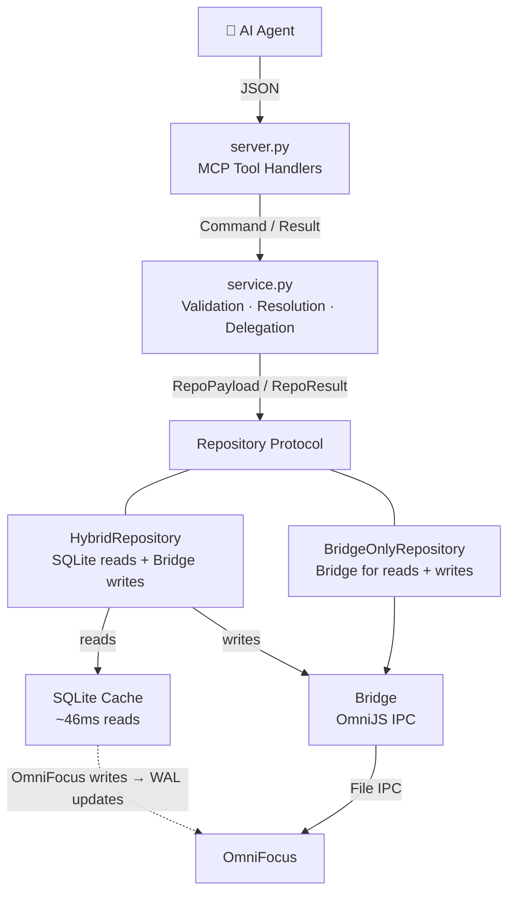
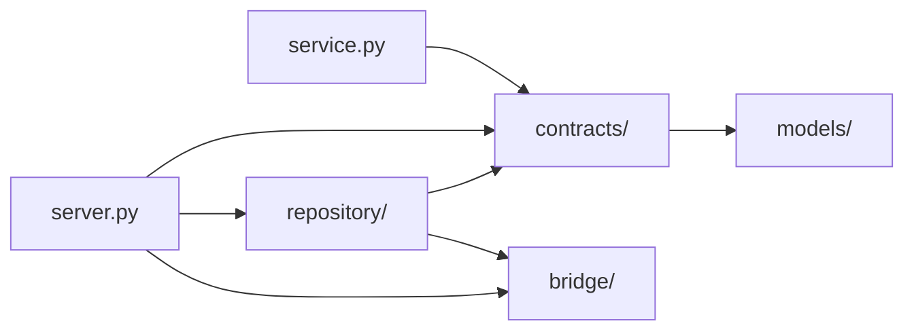
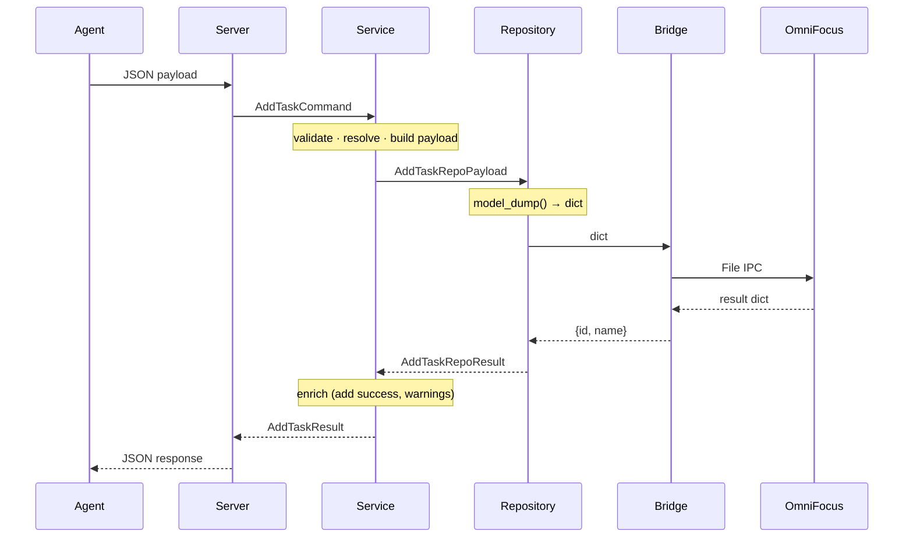
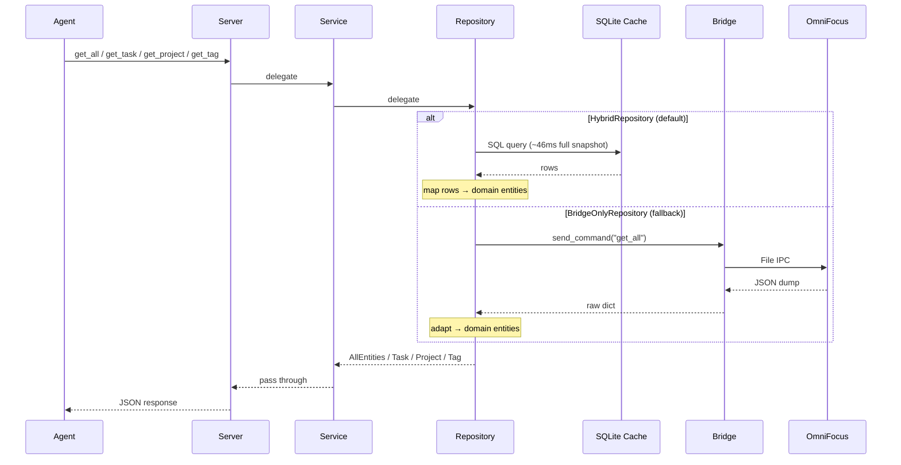

# Architecture Overview

## Layer Diagram



## Package Structure

```
omnifocus_operator/
    contracts/       -- Typed boundaries: protocols, commands, payloads, results
        protocols.py     -- Service, Repository, Bridge — all boundaries in one file
        base.py          -- CommandModel, UNSET sentinel
        shared/          -- Shared value objects across use cases
            actions.py       -- TagAction, MoveAction
            repetition_rule.py -- RepetitionRuleRepoPayload, frequency/end specs
        use_cases/       -- One sub-package per operation
            add/tasks.py     -- AddTaskCommand, AddTaskRepoPayload, AddTaskRepoResult, AddTaskResult
            edit/tasks.py    -- EditTaskCommand, EditTaskRepoPayload, EditTaskRepoResult, EditTaskResult
            list/            -- ListTasksQuery, ListProjectsQuery, repo queries, ListRepoResult
    models/          -- Read-side domain models (entities, enums, value objects)
    bridge/          -- OmniFocus communication (IPC, mtime, errors)
    repository/      -- Data access implementations + factory
        bridge_only/         -- Fallback: bridge for reads + writes
            bridge_only.py       -- BridgeOnlyRepository
            adapter.py           -- Raw bridge → model shape adapter
        hybrid/              -- Production: SQLite reads + bridge writes
            hybrid.py            -- HybridRepository
            query_builder.py     -- SQL query construction
        rrule/               -- RRULE serialization/parsing
        bridge_write_mixin.py -- Shared bridge write logic
        factory.py           -- create_repository() — selects implementation
    simulator/       -- Mock OmniFocus simulator for IPC testing
    server.py        -- FastMCP tool registration + wiring
    service/         -- Validation, resolution, domain logic, delegation
        service.py       -- Thin orchestrator (OperatorService)
        convert.py       -- Spec-to-core model conversion at service boundary
        resolve.py       -- Entity resolution (parent, tags, task)
        validate.py      -- Pure input validation
        domain.py        -- Product decisions: the opinionated logic that defines this tool's behavior
        payload.py       -- Typed repo payload construction
    agent_messages/  -- Agent-facing communication surface (warnings + errors)
        warnings.py      -- Centralized warning constants
        errors.py        -- Centralized error message constants
```

> [!important] Split principle
>
> - `models/` = what OmniFocus **IS** (domain entities, `OmniFocusBaseModel`)
> - `contracts/` = what you can **DO** (operations, boundaries, `CommandModel` with `extra="forbid"`)
> - Everything else = **how it's done** (implementations)
>
> Never embed a `models/` class directly in a `contracts/` command — the base class difference (`extra="forbid"`) means write-side models always need their own class, even with identical fields.

## Dependency Direction



- `contracts/` → `models/` (protocols reference domain entities)
- `service.py` → `contracts/` (protocols + commands + payloads + results)
- `server.py` → `contracts/` + concrete implementations (wiring only)
- `repository/` → `contracts/` (protocols + repo payloads + repo results) + `bridge/` (for writes)
- Tests use `InMemoryBridge` + `BridgeOnlyRepository` — no separate in-memory repository needed
- `models/` → nothing (leaf package, no outward dependencies except Pydantic)

## Protocols

All protocols live in `contracts/protocols.py` — one file shows every typed boundary in the system.

### Service protocol (agent ↔ service)

```python
class Service(Protocol):
    # Reads — return domain entities
    async def get_all_data(self) -> AllEntities: ...
    async def get_task(self, task_id: str) -> Task | None: ...
    async def get_project(self, project_id: str) -> Project | None: ...
    async def get_tag(self, tag_id: str) -> Tag | None: ...
    # Writes — take commands, return results
    async def add_task(self, command: AddTaskCommand) -> AddTaskResult: ...
    async def edit_task(self, command: EditTaskCommand) -> EditTaskResult: ...
```

### Repository protocol (service ↔ repository)

Two implementations: HybridRepository (production), BridgeOnlyRepository (fallback). Tests use BridgeOnlyRepository + InMemoryBridge.

```python
class Repository(Protocol):
    # Reads — return domain entities
    async def get_all(self) -> AllEntities: ...
    async def get_task(self, task_id: str) -> Task | None: ...
    async def get_project(self, project_id: str) -> Project | None: ...
    async def get_tag(self, tag_id: str) -> Tag | None: ...
    # Writes — take repo payloads, return repo results
    async def add_task(self, payload: AddTaskRepoPayload) -> AddTaskRepoResult: ...
    async def edit_task(self, payload: EditTaskRepoPayload) -> EditTaskRepoResult: ...
```

### Bridge protocol (repository ↔ OmniFocus)

```python
class Bridge(Protocol):
    async def send_command(self, operation: str, params: dict[str, Any] | None = None) -> dict[str, Any]: ...
```

## Write Pipeline



- **Service** does ALL processing — validation, parent/tag resolution, tag diff, move transformation, date serialization, no-op detection
- **Repository** is a pure pass-through — `model_dump()` → `send_command()` → wrap result
- **Bridge** is a dumb relay — receives pre-validated dicts, executes, returns minimal confirmation
- Parent resolution: try `get_project` first, then `get_task` — **project takes precedence** (intentional, deterministic)
- HybridRepository marks stale after write; BridgeOnlyRepository clears cache

### Method Object Pattern

All service use cases use the **Method Object** pattern: extract the method body into a short-lived class where each step is a named method and intermediate values live on `self`.

**Why:**
- A 100-line method with 12 local variables is *familiar* but forces you to track all state simultaneously
- A Method Object with a 12-line `execute()` method and 3-8 line steps is *readable* — each step is self-contained, named, navigable, and shows up in stack traces
- The value is self-documenting orchestration, not complexity management — even `add_task` (5 steps) reads better as a pipeline

```python
# Orchestrator stays thin -- one-liner delegation
async def edit_task(self, command: EditTaskCommand) -> EditTaskResult:
    pipeline = _EditTaskPipeline(self._resolver, self._domain, self._payload, self._repository)
    return await pipeline.execute(command)

# Pipeline reads like a table of contents
class _EditTaskPipeline:
    async def execute(self, command):
        await self._verify_task_exists()
        self._validate_and_normalize()
        self._detect_action_flags()
        self._apply_lifecycle()
        ...
```

**Conventions:**
- All pipelines inherit from `_Pipeline` (shared DI constructor)
- Class name: `_VerbNounPipeline` (private, underscore prefix) — e.g., `_AddTaskPipeline`, `_EditTaskPipeline`
- Constructor receives DI dependencies; `execute()` receives the input
- Mutable state on `self` is acceptable — the object is created, executed, and discarded within a single call. The lifetime is bounded.
- Step methods are private (`_verify_task_exists`, not `verify_task_exists`)
- Read delegation methods (get_task, get_project, etc.) stay inline on OperatorService — one-liner pass-throughs, not pipelines

### Service Layer: Product Decisions vs Plumbing

The service layer modules are organized around **product opinion vs mechanical plumbing** — not "pure vs impure" or "stateful vs stateless."

> [!important] The litmus test
>
> "Would another OmniFocus tool make this same choice?"
>
> - **Yes** → plumbing (any competent implementation needs it)
> - **No** → product decision (this is *our* choice, and it belongs in `domain.py`)

`domain.py` is where you look to understand what makes OmniFocus Operator *this particular product*. If you want to tweak the behavior that defines the tool, you should only need to look here.

Everything else in the service layer is plumbing — I/O sequencing, entity lookups, payload assembly, input validation. Necessary, but any implementation would do roughly the same thing.

| Concern | Where | Why |
|---------|-------|-----|
| "soon" without config → fall back to TODAY + warn | 🧠 domain | Another tool might error or guess. We chose conservative bounds + transparency |
| Lifecycle auto-include (completed filter → add COMPLETED availability) | 🧠 domain | Another tool might require explicit opt-in |
| `null` note → empty string | 🧠 domain | OmniJS rejects null, but *how* to handle it is a product choice |
| ALL mixed with other filters → warning | 🧠 domain | Behavioral guidance for agents — our opinion on what's helpful |
| No-op detection + educational warnings | 🧠 domain | We chose to warn, not silently succeed |
| Filter resolution warnings (multi-match, did-you-mean) | 🧠 domain | Agent UX choices — fuzzy matching policy |
| Fetching `due_soon_setting` from the repo | 🔧 pipeline | I/O sequencing — mechanical |
| Building `ListTasksRepoQuery` from resolved values | 🔧 pipeline | Assembly — mechanical |
| `{this: "w"}` → Monday-to-Sunday bounds | 📅 resolve_dates | Date arithmetic — any implementation needs this |
| Name → ID resolution with fuzzy matching | 🔍 resolve | Lookup mechanics — mechanical |
| Spec-to-core model conversion | 🔄 convert | Data mapping — structural |
| Repo payload construction | 📦 payload | Assembly — structural |

> [!note] Where does `resolve_dates.py` sit?
>
> - Contains opinions (show-more boundary choices, day-snapping behavior), but at the **per-field arithmetic** level
> - Domain calls into it for individual field resolution and owns the **cross-field orchestration** — lifecycle mapping, edge-case fallbacks, what to do when configuration is missing

### Date Filter Bounds: Two-Layer Contract

> [!note] The short version
>
> - 🤖 **Agent-facing** — **inclusive/inclusive** (`>=` and `<=`)
>   - Per the [Show-More Principle](#show-more-principle), no off-by-one surprises
> - ⚙️ **Internal** — **inclusive/exclusive** (`>=` and `<`)
>   - Half-open intervals compose cleanly
> - The resolution layer bridges the gap by shifting `before` values forward

Two distinct semantics at different layers:

- 🤖 **Agent-facing contract** (spec + tool descriptions)
  - `before` and `after` are both **inclusive**
  - Agents echo the user's dates: `{after: "2026-04-01", before: "2026-04-14"}` includes April 14
  - No off-by-one thinking required
- ⚙️ **Internal representation** (`ResolvedDateBounds`)
  - Classic half-open interval — `after` is inclusive (`>=`), `before` is exclusive (`<`)
  - Applied identically in SQL (`query_builder.py`) and bridge fallback (`bridge_only.py`)

The **resolution layer** (`resolve_dates.py`) bridges the two:

- `_parse_absolute_before()` bumps `before` values so `< before` includes the agent's boundary:
  - Date-only: +1 day — `before: "2026-03-31"` → `2026-04-01T00:00:00` → `< April 1 midnight` includes all of March 31
  - Datetime: +1 minute — `before: "2026-03-31T18:00:00"` → `2026-03-31T18:01:00` → `< 18:01` includes tasks due at exactly 18:00
- Shorthand periods (`this`, `last`, `next`) produce half-open bounds natively
  - `{this: "d"}` → `[today 00:00, tomorrow 00:00)` — adjacent periods share a boundary without overlap or gaps

> [!important] When adding new date comparison logic
>
> - Always use `>=` for `after` and `<` for `before` against `ResolvedDateBounds`
> - The resolution layer has already adjusted values to produce inclusive agent-facing behavior
> - Using `<=` for `before` would double-include the boundary day

## Read Pipeline



### Caching

- **HybridRepository** (default): SQLite cache, ~46ms full snapshot, OmniFocus not required
  - WAL-based freshness detection: 50ms poll, 2s timeout after writes
  - No caching layer on top — 46ms is fast enough
  - Marks stale after writes; next read waits for fresh WAL mtime
- **BridgeOnlyRepository** (fallback via `OPERATOR_REPOSITORY=bridge`): OmniJS bridge dump
  - mtime-based cache invalidation; checks file mtime before each read, serves cached snapshot if unchanged
  - Concurrent reads coalesce into a single bridge dump
- **Tests**: BridgeOnlyRepository + InMemoryBridge (no separate in-memory repository)

## Naming Conventions

### MCP tool verbs

Write tools use domain-native verbs, not CRUD:

| Verb | Operation | Examples |
|------|-----------|---------|
| `add_*` | Introduce a new entity into OmniFocus | `add_tasks`, future `add_projects` |
| `edit_*` | Modify an existing entity | `edit_tasks`, future `edit_projects` |
| `delete_*` | Remove an entity | future `delete_tasks` |
| `get_*` | Look up a single entity by ID | `get_task`, `get_project`, `get_tag` |
| `list_*` | Filtered collection of one entity type | `list_tasks`, `list_projects` |
| `count_*` | Count entities matching a filter | future `count_tasks` |

**Why "add" not "create":**
- "Add" is the natural verb for task management ("add a task to my inbox")
- Matches OmniJS domain language
- Forms a coherent verb system (add/edit/delete)
- "Create" is standard CRUD but sounds formal for the most common operation
- Tool descriptions use natural language freely — e.g., `add_tasks` description can say "Create tasks in OmniFocus." The tool name is the technical identifier, the description is the UX.

### Method names

- `get_all()` → `AllEntities`: structured container with all entity types
- `get_*` by ID → single entity lookup
- `list_*(filters)` → flat list of one entity type (e.g., `list_tasks(status=...)`)
- `add_*` / `edit_*` → write operations
- `get_*` = heterogeneous structured return; `list_*` = homogeneous filtered collection
- `AllEntities` (not `DatabaseSnapshot`) — no caching/snapshot semantics at the protocol level

### Model taxonomy

> [!tip] Full taxonomy with decision tree and examples
>
> See [Model Taxonomy](model-taxonomy.md) for the complete classification:
>
> - Core models vs boundary models
> - Suffix conventions (`Read`, `Command`, `Result`, `RepoPayload`, `RepoResult`)
> - Decision tree for where a new model goes

## Dumb Bridge, Smart Python

> [!important] The key invariant
>
> **The bridge is a relay, not a brain.** All validation, resolution, diff computation, and business logic lives in Python. The bridge receives pre-validated payloads and executes them without interpretation.

### Why

- **OmniJS freezes the UI** — every line of bridge logic is user-visible latency. Scanning 2,825 tasks takes ~1,264ms during which OmniFocus is unresponsive
- **OmniJS is quirky** — opaque enums, unreliable batch operations, null rejection. Sharp edges that are painful to debug
- **Python is testable** — 534 pytest tests cover service logic, adapter transformations, and repository behavior. Bridge.js has 26 Vitest tests for basic relay correctness — that's the right ratio
- **Python is typed** — Pydantic models, mypy strict mode, and structured error handling catch issues at development time, not at 7:30am in production

### Known OmniJS Quirks

Concrete examples of why logic stays out of the bridge:

- **`removeTags(array)` is unreliable** — bridge removes tags one at a time in a loop instead of batch (`bridge.js`, `handleEditTask`)
- **`note = null` is rejected** — OmniFocus API requires empty string to clear notes. Service maps `null → ""` before building the repo payload
- **Enums are opaque objects** — `.name` returns `undefined`. Only `===` comparison against known constants works. Bridge does minimal enum-to-string resolution and throws on unknowns
- **Same-container moves are no-ops** — `beginning`/`ending` moves within the same container don't reorder. Service detects this and warns with a workaround
- **Blocking state is invisible** — bridge cannot determine sequential dependencies or parent-child blocking. Only SQLite has full availability data (`BRIDGE-SPEC.md:FALL-02`)

### What Lives Where

| Concern | Where | Why |
|---------|-------|-----|
| Enum-to-string resolution | 🌉 Bridge | Must happen at source (opaque objects) |
| Tag name-to-ID resolution | ⚙️ Service | Case-insensitive matching, ambiguity errors |
| Tag diff computation | ⚙️ Service | Minimal add/remove sets, no-op warnings |
| Cycle detection (moves) | ⚙️ Service | Parent chain walk on cached snapshot — instant |
| No-op detection + warnings | ⚙️ Service | Field comparison before bridge delegation |
| Null-means-clear mapping | ⚙️ Service | Business logic, not transport |
| RRULE string generation | 🗄️ Repository | Repository owns RRULE both directions (see [RRULE Utility Layer](#rrule-utility-layer)) |
| Lifecycle (complete/drop) | ⚙️ Service + 🌉 Bridge | Service validates state, bridge executes `markComplete()`/`drop()` |
| Validation (structural) | 📐 Contract models | Pydantic validators on specs — value ranges, enum membership, field constraints |
| Validation (semantic) | ⚙️ Service | State checks, no-op detection, cross-entity resolution |

### The Result

The bridge is ~400 lines of trivial relay code. The rest of the project is ~14,000 lines of validated, typed, tested Python. That's the right split.

## Intuitive Time Principle

Date handling should match how users think about time — no timezone gymnastics, no off-by-one surprises. Two sub-principles:

- **Local time** — agents pass dates exactly as the user expressed them
- **Inclusive bounds** — `before: "July 15"` includes July 15 (see [Why inclusive?](#why-inclusive))

> [!important] Local time rule
>
> - `"Due at 5pm"` → `"dueDate": "2026-07-15T17:00:00"` — no offset, no conversion
> - Period boundaries (`"today"`, `"this week"`) align with the user's local calendar
> - Applies to **all** date handling — writes, reads, and filters

> [!important] Inclusive bounds rule
>
> - `before: "2026-07-15"` includes July 15 — agents echo the user's dates, no off-by-one thinking
> - `after: "2026-04-01"` includes April 1
> - Ephemeral bounds (`"overdue"`, `"soon"`, `"now"`) are exempt — [why?](#why-inclusive)

### Why local time?

OmniFocus stores every date as **naive local time** — "5pm" means 5pm in whatever timezone you're in when you set it. The server runs on the same Mac as OmniFocus. Local time in the API means zero conversion at every layer.

### Input contract

| Input | Behavior |
|-------|----------|
| 📍 Naive (`"17:00:00"`) | **Preferred** — passed through as-is on writes, treated as local on reads |
| 🌐 Aware (`"17:00:00Z"`, `"+01:00"`) | Accepted — converted to local, offset stripped |
| 📅 Date-only (`"2026-07-15"`) | Midnight local appended on writes; day-snapped on reads |

### Where each layer touches dates

- 📐 **Contract** — `str` type + syntax validator (parseable ISO?). No transformation
- 🧠 **Domain** — `normalize_date_input()` converts aware → local, appends midnight to date-only
- 📦 **Payload** — passes normalized string through to bridge
- 📅 **Resolver** — `local_now()` provides local-anchored "now"; period boundaries align with local calendar
  - `local_now()` = `datetime.now().astimezone()` — tz-aware local, lives in `config.py`

> [!warning] Why `str` and not Pydantic datetime types?
>
> - `NaiveDatetime`, `AwareDatetime`, and plain `datetime` all produce identical JSON Schema: `{"type": "string", "format": "date-time"}`
> - RFC 3339 §5.6 **requires** a timezone offset — contradicts our local-time contract
> - Only `str` drops the `format` constraint entirely

### Why inclusive?

Both `after` and `before` are **inclusive** from the agent's perspective — per the [Show-More Principle](#show-more-principle), boundary tasks should never silently disappear.

Internally, the repo uses half-open intervals (`>= after`, `< before`). The resolution layer bridges the gap by bumping `before` forward:

| Input type | Bump | Example |
|------------|------|---------|
| 📅 Date-only | +1 day | `"2026-07-15"` → `< July 16 midnight` — includes all of July 15 |
| 🕐 Datetime | +1 minute | `"2026-07-15T18:00:00"` → `< 18:01` — includes tasks due at exactly 18:00 |
| ⏱️ `"now"` literal | none | exact snapshot — see below |

> [!note] Why `"now"`, `"overdue"`, and `"soon"` are NOT bumped
>
> These are **ephemeral boundaries** — they move every second. Bumping creates observable wrongness that lasts longer than the edge case it fixes:
>
> - 🕐 **`"overdue"` / `before: "now"`** — a task due at *exactly* this second is excluded
>   - One second later → correctly included (genuinely past-due)
>   - Bumping +1 minute → tasks due *1 minute in the future* show as overdue for a full minute
>   - Transient 1-second edge case vs 1-minute observable wrongness => **don't bump**
> - ⏳ **`"soon"`** — computed threshold, not agent-specified
>   - Calendar-aligned (`due_soon_setting.calendar_aligned`) → snaps to midnight, day granularity — same analysis as overdue
>   - Rolling (24h window) → `now + N*24h` — boundary moves every second, same 1-second transient
>
> **The principle:** bump policy follows intent, not mechanics
>
> - Agent specifies a **deliberate** boundary → bump it (honor inclusive contract)
> - System computes an **ephemeral** boundary → don't bump (the boundary is already moving)

---

_Empirically verified across 430 tasks in BST and GMT. See `.research/deep-dives/timezone-behavior/RESULTS.md` for full data._

## True Inheritance Principle

OmniFocus stores "effective" values for inherited fields — `effectiveDueDate`, `effectiveFlagged`, etc. These are derived from the ancestor chain using field-specific rules (see "Per-field inheritance rules" below). The problem: OmniFocus **always** populates these fields, even when no ancestor contributes. A task with `dueDate: May 1` and no ancestors gets `effectiveDueDate: May 1` — a self-echo, not true inheritance.

Self-echoes are misleading for agents. An agent seeing `inheritedDueDate` assumes an ancestor set that deadline. If it's just the task's own date reflected back, the agent has false context about where the constraint comes from.

> [!important] The rule
>
> **`inherited*` fields only appear when an ancestor actually contributes the value.**
>
> - No ancestor has the field set → strip `inherited*` from the response (self-echo)
> - An ancestor has the field set → show `inherited*` with the ancestor's actual value
> - The task's own value and the inherited value coexist independently

### How it works: the hierarchy walk

The service layer's `DomainLogic.compute_true_inheritance()` reconstructs inherited values by walking the ancestor chain:

1. Build `task_map` and `project_map` from the full snapshot (`get_all()`)
2. For each task, walk up: `parent.task.id` → grandparent → ... → containing `project.id`
3. For each of the 6 inherited field pairs (`flagged`/`inherited_flagged`, `due_date`/`inherited_due_date`, etc.):
   - Check if any ancestor has the source field set
   - **If yes** → compute the inherited value from ancestors (per-field rule — see below)
   - **If no** → reset inherited field to `None`/`False` (strip self-echo)
4. Return `task.model_copy(update=...)` with corrected inherited fields

The walk runs in the service layer, applied to all three task-returning paths: `get_all`, `get_task`, and `list_tasks`. Projects have no inherited fields (structurally removed from the model).

### The two-field model

Every inheritable field has two output fields:

| Field | Meaning | Editable? |
|-------|---------|-----------|
| `dueDate` | The task's own directly-set due date | Yes — `edit_tasks` |
| `inheritedDueDate` | The due date contributed by the ancestor chain (see per-field rules) | No — edit the ancestor instead |

> [!important] How `inherited*` is computed (the ancestor walk)
>
> The `inherited*` field is **purely the ancestor contribution** — the task's own value is never part of this computation. Each field family uses a different aggregation strategy:
>
> | Family | `inherited*` field | Ancestor walk rule |
> |--------|-------------------|-------------------|
> | **Constraint (min)** | `inheritedDueDate` | `min` across all ancestors with the field set |
> | **Constraint (max)** | `inheritedDeferDate` | `max` across all ancestors with the field set |
> | **Override (first-found)** | `inheritedPlannedDate`, `inheritedDropDate`, `inheritedCompletionDate` | Walk up, stop at the first ancestor with a value |
> | **Boolean OR** | `inheritedFlagged` | `True` if any ancestor is flagged |
>
> Both own and inherited are always shown independently when they exist. The agent sees both.

> [!note] How OmniFocus computes `effective*` (context)
>
> OmniFocus exposes both `dueDate` (own) and `effectiveDueDate` (resolved) for each field. We replace `effective*` with `inherited*` because the ancestor's actual contribution has more signal than the merged result — and no self-echo when ancestors don't contribute. For reference, how OmniFocus resolves its effective values:
>
> | Family | OmniFocus `effective*` rule |
> |--------|---------------------------|
> | Constraint (min) | `min(own dueDate, parent's effectiveDueDate)` — soonest deadline in the hierarchy wins |
> | Constraint (max) | `max(own deferDate, parent's effectiveDeferDate)` — latest block in the hierarchy wins |
> | Override | `own completionDate ?? parent's effectiveCompletionDate` — own always takes precedence; ancestors only matter when own is unset |
> | Boolean OR | `own flagged \|\| parent's effectiveFlagged` — any flagged node in the hierarchy flags all descendants |
>
> By replacing `effective*` with `inherited*`, agents see the ancestor's actual contribution rather than a merged result — and no field at all when ancestors don't contribute (eliminating self-echoes).
>
> **Effective values are derived, not stored.** OmniFocus re-walks the ancestor chain every time — there is no cached "effectively dropped at" event. Dropping a nearer ancestor changes the effective value even if the task was already effectively dropped from a further ancestor. See `.research/deep-dives/omnifocus-inheritance-semantics/FINDINGS.md` for the full empirical study.
>
> In practice, **agents rarely need to think about this** — filtering uses effective dates server-side. `list_tasks due: {next: "w"}` returns the right tasks regardless of whether the due date is own or inherited.

### Concrete examples

**Inbox task with own due date, no ancestors:**

```
Inbox
  └── Buy groceries              ← dueDate: 2026-05-01

Response:
  dueDate: 2026-05-01            ← own date, editable
                                  ← no inheritedDueDate (stripped — no ancestor)
```

**Task in a flagged project (task itself not flagged):**

```
🚩 Launch Website (project)      ← flagged: true
  └── Update copy                 ← flagged: false

Response for "Update copy":
                                  ← no flagged field (false, stripped)
  inheritedFlagged: true          ← from project, truly inherited
```

**Subtask with earlier due date than parent:**

```
📋 Q3 Planning (project)         ← dueDate: 2036-03-01
  └── Review roadmap              ← dueDate: 2026-05-01
       └── Check milestones       ← dueDate: 2026-04-25

Response for "Check milestones":
  dueDate: 2026-04-25            ← own date (sooner)
  inheritedDueDate: 2026-05-01   ← parent task's due date (soonest ancestor)
```

The agent sees both and understands: the task's own deadline is sooner, but an ancestor also imposes a constraint. Editing `dueDate` works directly. To change the inherited date, edit the parent.

**Subtask with own defer date earlier than project's:**

```
📋 Q3 Planning (project)         ← deferDate: 2026-03-21
  └── Draft timeline              ← deferDate: 2026-03-10

Response for "Draft timeline":
  deferDate: 2026-03-10          ← own defer date
  inheritedDeferDate: 2026-03-21 ← project's defer date (governs availability)
```

For defer dates, the **later** value governs — the task can't be available before the project is. Both fields appear, the agent sees the full picture.

**Override (first-found) — planned date from nearest ancestor:**

```
📋 Q3 Planning (project)         ← plannedDate: 2026-04-01
  └── Design phase                ← plannedDate: 2026-05-15
       └── Pick color palette     ← (no own plannedDate)

Response for "Pick color palette":
                                  ← no plannedDate (not set directly)
  inheritedPlannedDate: 2026-05-15 ← from "Design phase" (nearest ancestor)
```

The project's planned date (April) exists further up, but the walk stops at "Design phase" (May) because it's the nearest ancestor with a value. This is the override/first-found rule — unlike min/max, further ancestors are invisible once a nearer one has the field set.

### Why this works for agents

- **Filtering handles the 90% case** — `list_tasks due: {next: "w"}` uses effective dates. The agent asks "what's due this week?" and gets the right answer without thinking about inheritance.
- **Read-write symmetry** — `dueDate` in the response is the same `dueDate` in `edit_tasks`. What you see is what you can edit.
- **Detail on demand** — the inherited field explains *why* a task has a constraint. Most of the time agents don't need it. When they do (debugging, re-prioritizing), it's right there.

## Show-More Principle

In a task manager, error costs are asymmetric:

- **Showing one extra task** — the user glances at it, sees it's irrelevant, moves on. Cost: near zero.
- **Missing a task** — the user doesn't know what they can't see. They miss a deadline, forget a commitment, lose trust in the tool. Cost: high.

Same tradeoff as tuning a classifier — a spam filter tolerates false negatives to avoid burying real emails, but medical screening biases hard toward flagging anything suspicious. Task management is closer to medical screening: the cost of a miss far outweighs the cost of showing too much.

> [!important] The rule
>
> **Every ambiguous boundary decision biases toward inclusion.**
>
> - Boundary could be inclusive or exclusive? → inclusive
> - "Due soon" could exclude or include overdue? → include
> - Time period count is ambiguous? → round toward showing more

### Applied examples

| Decision | Clean/precise option | Generous option | Chosen |
|----------|---------------------|-----------------|--------|
| `available` filter | Only strictly-available tasks | Includes `next` (first available in sequential project) | Generous |
| `blocked` filter | Only tasks blocked by other tasks | All four blocking reasons (deferred, sequential, parent, on-hold) | Generous |
| `"soon"` shorthand | Future-only window | Upper-bound threshold — overdue is a natural subset | Generous |
| Day-snapping (`{last: "3d"}`) | Exactly 3 calendar days | 3 full past days + partial today (N+1 touched) | Generous |
| `before` boundary | Exclusive (half-open, composable) | Inclusive (agents echo user's dates, it just works) | Generous |

In every case: the generous option means "you might see one extra task." The clean option means "you might miss one."

### When NOT to apply

- **Strict filters are strict** — `flagged: true`, `availability: "available"` — no fuzziness. These aren't boundary cases, they're different questions.
- **Default exclusions are intentional** — completed/dropped tasks require an explicit filter. "Show active tasks" is a clear design choice, not an ambiguous boundary.
- **The principle is a tiebreaker**, not a blanket rule. If the answer is obviously "exclude," exclude.

## Structure Over Discipline

*Designing architecture for agents who always take the shortest path.*

Agents optimize for least resistance uniformly and instantly — they don't leave legible patterns you can learn from. So: **pave first.** Make the structure guide toward the right choice, not discipline or documentation.

- **Prefer duplication over shared abstractions** when paths will diverge — separate types per operation, separate classes even when fields match today. Agents won't recognize when a shared abstraction is the wrong fit.
- **Use the type system to make wrong states unrepresentable** — distinct types at each boundary, sentinel types for ambiguous states. If the wrong choice doesn't compile, agents can't take it.
- **Make module boundaries self-documenting** — when the module name tells you where new code goes, agents don't need to make judgment calls about placement.

> [!tip] Full writeup with examples
>
> See [Structure Over Discipline](structure-over-discipline.md) for concrete examples of each principle applied in this codebase.

## Write API Patterns

### Patch semantics (edit_tasks)

Three-way field distinction: omit = no change, null = clear, value = set.

```json
{
  "id": "abc123",
  "name": "New name",      // value → set
  "dueDate": null,         // null  → clear
                           // note  → omitted, no change
}
```

- Pydantic sentinel pattern (UNSET) distinguishes "not provided" from "explicitly null"
- Clearable fields: dates, note, estimated_minutes. Value-only: name, flagged
- Bridge payload only includes non-UNSET fields; bridge.js uses `hasOwnProperty()` to detect presence

### Task movement (actions.move)

"Key IS the position" design — the `MoveAction` has exactly one key:

```json
{"move": {"ending": "proj-123"}}       // last child of container
{"move": {"beginning": "proj-123"}}    // first child of container
{"move": {"after": "task-sibling"}}    // after this sibling (parent inferred)
{"move": {"before": "task-sibling"}}   // before this sibling (parent inferred)
{"move": {"beginning": null}}          // move to inbox
```

- Lives under `actions.move` in the `EditTaskCommand` (see [Field graduation](#field-graduation))
- One key = one position + one reference. Invalid combos are structurally impossible.
- Maps directly to OmniJS position API: `container.beginning`, `container.ending`, `task.before`, `task.after`
- Full cycle validation via SQLite parent chain walk before bridge call

### Field graduation

The edit API separates **setters** (top-level fields) from **actions** (operations that modify state):

```json
{
  "id": "xyz",
  "name": "Renamed",        // setter -- simple field replacement
  "flagged": true,           // setter
  "actions": {               // actions -- operations with richer semantics
    "tags": { "add": [...], "remove": [...] },   // or "replace": [...]
    "move": { "after": "sibling-id" },
    "lifecycle": "complete"
  }
}
```

- **Setters** — idempotent field replacements (top-level). Generic no-op warning when value unchanged.
- **Actions** — operations that modify relative to current state (nested under `actions`). Action-specific warnings (e.g., "Tag 'X' is already on this task").
- **Any field can graduate** from setter to action group when it needs more than simple replacement.
  - Migration path:
    1. Remove the field from top-level setters
    2. Add it as an action group under `actions` with `replace` + new operations
  - **Example:** `note` could graduate to `actions.note: { replace: "...", append: "..." }` when append-note is needed.
- **Tags are the first graduated field:**

  ```json
  // Before graduation (v1.2.0): top-level setter, replace-only
  { "tags": ["Work", "Planning"] }

  // After graduation (v1.2.1): action group with add/remove/replace
  { "actions": { "tags": { "add": ["Urgent"], "remove": ["Planning"] } } }
  ```

- **Each graduation is independent** — migrate one field at a time as use cases emerge.

### Agent-facing messages

All agent-facing text is centralized in `agent_messages/` with AST-based test enforcement preventing inline regressions. Agents learn from every response, so message quality is a first-class concern.

- Write results include optional `warnings` array for no-ops and edge cases
- Errors (`ValueError`) use the same centralized constant + `.format()` pattern as warnings
- Examples:
  - Tag no-op: "Tag 'X' was not on this task — omit remove_tags to skip"
  - Setter no-op: "Field 'flagged' is already true — omit to skip"
  - Same-container move: "Task is already in this container. Use 'before' or 'after' with a sibling task ID to control ordering."
  - Lifecycle on completed: "Task is already completed — no change made"

## Two-Axis Status Model

- **Urgency**: `overdue`, `due_soon`, `none` — time-based, computed from dates
- **Availability**: `available`, `blocked`, `completed`, `dropped` — lifecycle state
- Replaces single-winner status enum from v1.0; matches OmniFocus internal representation

## Presence Flags

Lightweight booleans that signal "there's content here — ask for it via an include group if you want it." They appear in the default response only when `true`, stripped when `false` — so their presence IS the signal.

> [!important] The rule
>
> **A presence flag earns a spot in the default response only when the `true` case is rare.**
>
> - Rare → usually absent, so stripping materially shrinks the default payload
> - Common → present most of the time, signal dilutes, payload grows for nothing

### Qualifying fields

| Field | Signals | Why it qualifies |
|-------|---------|------------------|
| `hasNote` | A note exists — fetch via `include: ["notes"]` | Most tasks have no note |
| `hasRepetition` | A repetition rule exists | Most tasks aren't recurring |
| `hasAttachments` | Attachments exist | Most tasks have none; binary content never belongs in default |

### Why `hasSubtasks` stays in the `hierarchy` include group

`hasSubtasks` looks like it belongs with the family above, but it fails the rarity test — many tasks have children, so the flag would be `true` in a large share of responses. Stripping buys nothing, and the "presence IS the signal" model loses force when the field is present most of the time.

Keeping it in the `hierarchy` include group gives the same information to agents who care about structure, without cluttering every default response with a flag that's almost always set.

## Repetition Rule: Structured Fields, Not RRULE Strings

> **Status:** Read + write models implemented (v1.2.3) — flat `Frequency` model, `parse_rrule()`, `build_rrule()`. Type optional on edits.

Agents never see RRULE strings. The read and write models expose repetition as structured fields with a flat frequency model. The RRULE string is an internal serialization detail between the service layer and the bridge.

> [!note] Why top-level (not inside `actions`)?
>
> - Setting a repetition rule is **idempotent** — same input always produces the same result, regardless of current state
> - Follows the same pattern as `due_date`, `note` — set, clear, or leave unchanged

### Repetition Rule Structure

```
repetitionRule
├── frequency                    -- flat model, 6 types + optional specialization fields
│   ├── type                     -- required on read/add, optional on edit (inferred from existing)
│   ├── interval                 -- every N of that type (default: 1, omitted in output when 1)
│   └── onDays / on / onDates    -- optional specialization (see below)
├── schedule                     -- "regularly" | "regularly_with_catch_up" | "from_completion"
├── basedOn                      -- "due_date" | "defer_date" | "planned_date"
└── end                          -- optional: {"date": "ISO-8601"} or {"occurrences": N}
```

- `schedule` — three values; collapses scheduleType + catchUpAutomatically into one field
- `basedOn` — renamed from anchorDateKey to match OmniFocus UI language ("based on due date"). See [OmniFocus Concepts](omnifocus-concepts.md#dates) for date semantics
- `end` — "key IS the value" pattern (same as [actions.move](#task-movement-actionsmove)): exactly one key, omit for no end
- `frequency.interval` — nested (tightly coupled with type: "every 2 weeks" is one concept). Omitted from read output when 1 (the default)

### Frequency Types

Six types sharing a single flat model. Optional fields specialize the base type — no sub-types needed:

| Type | Optional fields | Example |
|------|-----------------|---------|
| `minutely` | — | Every 30 minutes |
| `hourly` | — | Every 2 hours |
| `daily` | — | Every 3 days |
| `weekly` | `onDays`: `string[]` — two-letter codes (MO–SU) | Every 2 weeks; optionally on specific days |
| `monthly` | `on`: `object` — `{ordinal: dayName}`, OR `onDates`: `int[]` — day numbers (1–31, -1 = last) | Every month; optionally on nth weekday or specific dates |
| `yearly` | — | Every year |

`on` and `onDates` are mutually exclusive on `monthly` — you specify a weekday pattern OR specific dates, not both. Cross-type fields are rejected with an educational error.

```json
// weekly → onDays: array of two-letter day codes (case-insensitive, normalized to uppercase)
"onDays": ["MO", "WE", "FR"]

// monthly → on: single key-value object (reads like English: "on the second Tuesday")
// Keys: first, second, third, fourth, fifth, last
// Values: monday–sunday, weekday, weekend_day (case-insensitive, normalized to lowercase)
"on": {"second": "tuesday"}

// monthly → onDates: array of integers (1–31, -1 for last day)
"onDates": [1, 15, -1]
```

### Examples

**Daily** — every 3 days, from completion, based on defer date:
```json
{
  "repetitionRule": {
    "frequency": { "type": "daily", "interval": 3 },
    "schedule": "from_completion",
    "basedOn": "defer_date"
  }
}
```

**Weekly** — every 2 weeks on Mon and Fri, regularly with catch-up, based on due date:
```json
{
  "repetitionRule": {
    "frequency": { "type": "weekly", "interval": 2, "onDays": ["MO", "FR"] },
    "schedule": "regularly_with_catch_up",
    "basedOn": "due_date"
  }
}
```

**Monthly (nth weekday)** — the last Friday of every month, stop after 12 occurrences:
```json
{
  "repetitionRule": {
    "frequency": { "type": "monthly", "on": {"last": "friday"} },
    "schedule": "regularly",
    "basedOn": "due_date",
    "end": { "occurrences": 12 }
  }
}
```

**Monthly (specific dates)** — the 1st and 15th of every month, until a date:
```json
{
  "repetitionRule": {
    "frequency": { "type": "monthly", "onDates": [1, 15] },
    "schedule": "regularly_with_catch_up",
    "basedOn": "planned_date",
    "end": { "date": "2026-12-31" }
  }
}
```

**Clear** — standard patch semantics: `"repetitionRule": null`

### Partial Update Semantics

Repetition rules support targeted partial updates on `edit_tasks`, following two rules:

1. **Root-level fields are independently updatable** — change `schedule`, `basedOn`, or `end` without resending other fields
2. **Frequency object uses type as the merge boundary:**
   - `type` optional on same-type updates — inferred from existing task
   - Same type → merge (omitted fields preserved from existing rule)
   - Type changes → `type` required + full replacement (defaults apply like creation)
   - Specialization fields (`onDays`, `on`, `onDates`) can be added or cleared without changing type

```json
// Change only basedOn (everything else preserved):
{ "repetitionRule": { "basedOn": "defer_date" } }

// Change interval on existing task (type inferred from existing):
{ "repetitionRule": { "frequency": { "interval": 5 } } }

// Add specific days to a weekly task (no type change needed):
{ "repetitionRule": { "frequency": { "onDays": ["MO", "WE", "FR"] } } }

// Remove day constraint from weekly (clear the field):
{ "repetitionRule": { "frequency": { "onDays": null } } }

// Switch from date-based to weekday-based monthly (onDates auto-cleared):
{ "repetitionRule": { "frequency": { "on": {"last": "friday"} } } }

// Switch from daily to weekly (type required for type change):
{ "repetitionRule": { "frequency": { "type": "weekly", "onDays": ["MO", "FR"] } } }
```

No existing rule + partial update → error: "Task has no repetition rule. Provide a complete rule."

### RRULE Utility Layer

The `repository/rrule/` package owns RRULE translation in both directions. Service works exclusively with core types (`Frequency`, `Schedule`, `BasedOn`, `EndCondition`) — it never sees RRULE strings.

#### Write Path

- Service builds a `RepetitionRuleRepoPayload` (all core types) and hands it to the repository
- `bridge_write_mixin._dump_payload()` intercepts and delegates to `rrule/serialize.py`
- `serialize.py` calls `builder.py` (Frequency → RRULE string) and `schedule.py` (Schedule/BasedOn → bridge enums)
- Bridge receives flat `{ruleString, scheduleType, anchorDateKey, catchUpAutomatically}`

#### Read Path

- Both read implementations (`hybrid.py`, `adapter.py`) normalize raw fields via mapping tables, then call shared `rrule/` functions
- `parser.py`: `parse_rrule()` → `Frequency`, `parse_end_condition()` → `EndCondition | None`
- `schedule.py`: `derive_schedule()` → `Schedule`, anchorDateKey → `BasedOn`
- Assembled into `RepetitionRule` (core model) — service receives clean types

---

_For detailed flow diagrams — write (add/edit) and read pipelines with full data flow: [repetition-rule-flow.md](repetition-rule-flow.md)_

### Validation Layers

Three layers, all before bridge execution:

1. **Pydantic structural** (contract model validators) — required fields, enum values, `end` has exactly one key
2. **Type-specific constraints** (contract model validators) — reject fields that don't belong to given frequency type; value ranges (interval >= 1, valid day codes, valid ordinals, dayOfMonth -1 to 31 excluding 0)
3. **Service semantic** (service layer) — no existing rule + partial update, type change + incomplete frequency, no-op detection with educational warnings

## Design Rationale

### Why Repository, not DataSource

- Repository implies querying/filtering — `list_tasks(filters)` in v1.3
- DataSource implies raw data access — too thin an abstraction
- Repository is the richer contract for how consumers interact with data

### Why flat packages (bridge/ and repository/ as peers)

- Bridge is a general OmniFocus communication channel, not just data access
- Future milestones: perspective switching, UI actions — all via Bridge directly
- Write operations go through Bridge (repository delegates)
- `repository/` depends on `bridge/` (never reverse)
- Keeping them as siblings avoids false nesting (`repository/bridge/` would imply ownership)

## Deferred Decisions

- Multi-repository coordination in OperatorService (if needed)
