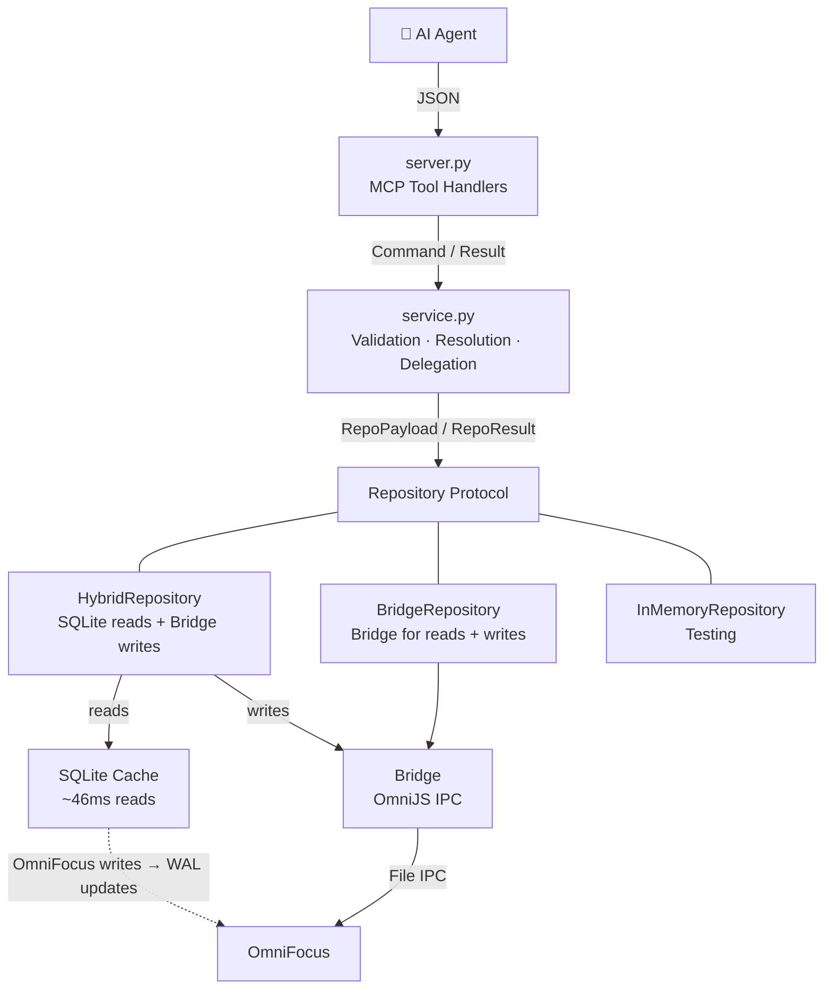
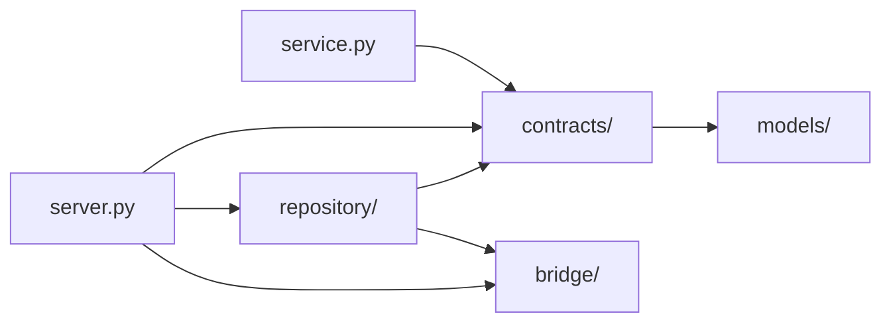
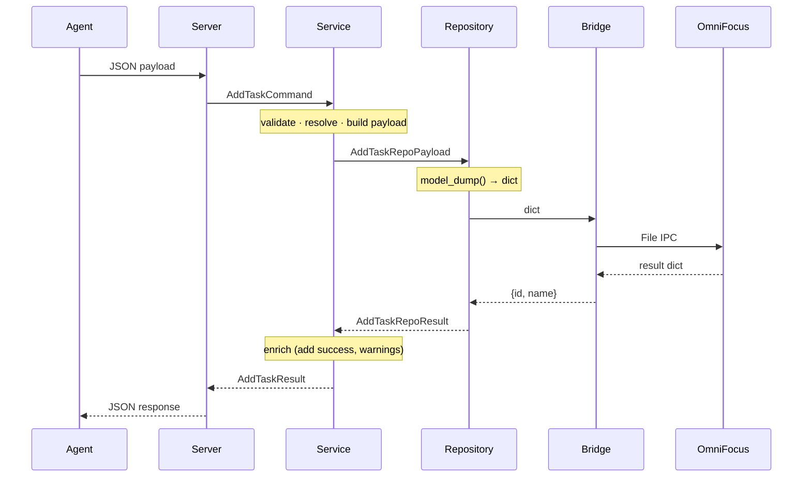
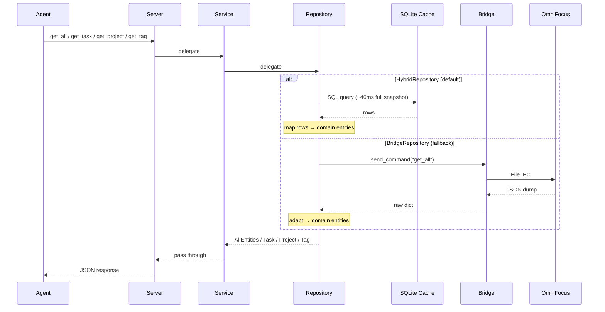
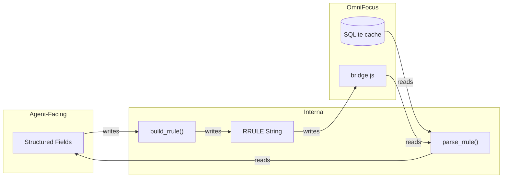

# Architecture Overview

## Layer Diagram



## Package Structure

```
omnifocus_operator/
    contracts/       -- Typed boundaries: protocols, commands, payloads, results
        protocols.py     -- Service, Repository, Bridge — all boundaries in one file
        base.py          -- CommandModel, UNSET sentinel
        common.py        -- Shared value objects (TagAction, MoveAction)
        use_cases/       -- One module per operation
            create_task.py   -- AddTaskCommand, AddTaskRepoPayload, AddTaskRepoResult, AddTaskResult
            edit_task.py     -- EditTaskCommand, EditTaskActions, EditTaskRepoPayload, EditTaskRepoResult, EditTaskResult
    models/          -- Read-side domain models (entities, enums, value objects)
    bridge/          -- OmniFocus communication (IPC, in-memory, simulator)
    repository/      -- Data access implementations + factory
    simulator/       -- Mock OmniFocus simulator for IPC testing
    server.py        -- FastMCP tool registration + wiring
    service/         -- Validation, resolution, domain logic, delegation
        service.py       -- Thin orchestrator (OperatorService)
        resolve.py       -- Entity resolution (parent, tags, task)
        validate.py      -- Pure input validation
        domain.py        -- Business rules (lifecycle, tags, cycle, no-op, move)
        payload.py       -- Typed repo payload construction
    agent_messages/  -- Agent-facing communication surface (warnings + errors)
        warnings.py      -- Centralized warning constants
        errors.py        -- Centralized error message constants
```

**Split principle:** `models/` = what OmniFocus IS (domain entities, `OmniFocusBaseModel`). `contracts/` = what you can DO (operations, boundaries, `CommandModel` with `extra="forbid"`). Everything else = how it's done (implementations). Never embed a `models/` class directly in a `contracts/` command — the base class difference (`extra="forbid"`) means write-side models always need their own class, even with identical fields.

## Dependency Direction



- `contracts/` → `models/` (protocols reference domain entities)
- `service.py` → `contracts/` (protocols + commands + payloads + results)
- `server.py` → `contracts/` + concrete implementations (wiring only)
- `repository/` → `contracts/` (protocols + repo payloads + repo results) + `bridge/` (for writes)
- `repository/in_memory.py` → `contracts/` + `models/` only (zero bridge dependency)
- `models/` → nothing (leaf package, no outward dependencies except Pydantic)

## Protocols

All protocols live in `contracts/protocols.py` — one file shows every typed boundary in the system.

### Service protocol (agent ↔ service)

```python
class Service(Protocol):
    # Reads — return domain entities
    async def get_all_data(self) -> AllEntities: ...
    async def get_task(self, task_id: str) -> Task | None: ...
    async def get_project(self, project_id: str) -> Project | None: ...
    async def get_tag(self, tag_id: str) -> Tag | None: ...
    # Writes — take commands, return results
    async def add_task(self, command: AddTaskCommand) -> AddTaskResult: ...
    async def edit_task(self, command: EditTaskCommand) -> EditTaskResult: ...
```

### Repository protocol (service ↔ repository)

Three implementations: HybridRepository (production), BridgeRepository (fallback), InMemoryRepository (tests).

```python
class Repository(Protocol):
    # Reads — return domain entities
    async def get_all(self) -> AllEntities: ...
    async def get_task(self, task_id: str) -> Task | None: ...
    async def get_project(self, project_id: str) -> Project | None: ...
    async def get_tag(self, tag_id: str) -> Tag | None: ...
    # Writes — take repo payloads, return repo results
    async def add_task(self, payload: AddTaskRepoPayload) -> AddTaskRepoResult: ...
    async def edit_task(self, payload: EditTaskRepoPayload) -> EditTaskRepoResult: ...
```

### Bridge protocol (repository ↔ OmniFocus)

```python
class Bridge(Protocol):
    async def send_command(self, operation: str, params: dict[str, Any] | None = None) -> dict[str, Any]: ...
```

## Write Pipeline



- **Service** does ALL processing: validation, parent/tag resolution, tag diff, move transformation, date serialization, no-op detection
- **Repository** is a pure pass-through: `model_dump()` → `send_command()` → wrap result
- **Bridge** is a dumb relay: receives pre-validated dicts, executes, returns minimal confirmation
- Parent resolution: try `get_project` first, then `get_task` — **project takes precedence** (intentional, deterministic)
- HybridRepository marks stale after write; BridgeRepository clears cache

### Method Object Pattern (complex pipelines)

When a service method has many sequential steps with intermediate state, we use the **Method Object** pattern: extract the method body into a short-lived class where each step is a named method and intermediate values live on `self`.

**Why:** Familiarity vs readability. A 100-line method with 12 local variables and numbered comments is *familiar* but forces you to track all state simultaneously. A Method Object with a 12-line `execute()` method and 3-8 line steps is *readable* — each step is self-contained, named, navigable, and shows up in stack traces.

**How it works:**

```python
# Orchestrator stays thin -- one-liner delegation
async def edit_task(self, command: EditTaskCommand) -> EditTaskResult:
    pipeline = _EditTaskPipeline(self._resolver, self._domain, self._payload, self._repository)
    return await pipeline.execute(command)

# Pipeline reads like a table of contents
class _EditTaskPipeline:
    async def execute(self, command):
        await self._verify_task_exists()
        self._validate_and_normalize()
        self._detect_action_flags()
        self._apply_lifecycle()
        ...
```

**When to use:** All service-layer use cases — not just complex ones. The pattern makes any orchestration method self-documenting. Even `add_task` (5 steps) reads better as a pipeline than inline code with variables flowing between steps. The value is self-documenting orchestration, not complexity management.

**Conventions:**
- All pipelines inherit from `_Pipeline` (shared DI constructor)
- Class name: `_VerbNounPipeline` (private, underscore prefix) — e.g., `_AddTaskPipeline`, `_EditTaskPipeline`
- Constructor receives DI dependencies; `execute()` receives the input
- Mutable state on `self` is acceptable — the object is created, executed, and discarded within a single call. The lifetime is bounded.
- Step methods are private (`_verify_task_exists`, not `verify_task_exists`)
- Read delegation methods (get_task, get_project, etc.) stay inline on OperatorService — they're one-liner pass-throughs, not pipelines

## Read Pipeline



### Caching

- **HybridRepository** (default): SQLite cache, ~46ms full snapshot, OmniFocus not required
  - WAL-based freshness detection: 50ms poll, 2s timeout after writes
  - No caching layer on top — 46ms is fast enough
  - Marks stale after writes; next read waits for fresh WAL mtime
- **BridgeRepository** (fallback via `OMNIFOCUS_REPOSITORY=bridge`): OmniJS bridge dump
  - mtime-based cache invalidation; checks file mtime before each read, serves cached snapshot if unchanged
  - Concurrent reads coalesce into a single bridge dump
- **InMemoryRepository** (tests): no caching (returns constructor snapshot as-is)

## Naming Conventions

### MCP tool verbs

Write tools use domain-native verbs, not CRUD:

| Verb | Operation | Examples |
|------|-----------|---------|
| `add_*` | Introduce a new entity into OmniFocus | `add_tasks`, future `add_projects` |
| `edit_*` | Modify an existing entity | `edit_tasks`, future `edit_projects` |
| `delete_*` | Remove an entity | future `delete_tasks` |
| `get_*` | Look up a single entity by ID | `get_task`, `get_project`, `get_tag` |
| `list_*` | Filtered collection of one entity type | future `list_tasks`, `list_projects` |
| `count_*` | Count entities matching a filter | future `count_tasks` |

**Why "add" not "create":** Deliberate decision after extensive analysis. "Add" is the natural verb for task management ("add a task to my inbox"), matches OmniJS domain language, and forms a coherent verb system (add/edit/delete). "Create" is standard CRUD but sounds formal for the most common operation (tasks). Tool descriptions use natural language freely — e.g., `add_tasks` description can say "Create tasks in OmniFocus" — the tool name is the technical identifier, the description is the UX.

### Method names

- `get_all()` → `AllEntities`: structured container with all entity types
- `get_*` by ID → single entity lookup
- `list_*(filters)` → flat list of one entity type (e.g., `list_tasks(status=...)`) — planned for v1.3
- `add_*` / `edit_*` → write operations
- `get_*` = heterogeneous structured return; `list_*` = homogeneous filtered collection
- `AllEntities` (not `DatabaseSnapshot`) — no caching/snapshot semantics at the protocol level

### Model taxonomy (CQRS/DDD-inspired)

Every model's name indicates its layer and role. Write-side models use suffixes that signal their boundary and direction. Read-side models use bare names by default; a `Read` suffix is added only when the output boundary needs a different shape than the core model.

**Core model as gravitational center:** The core model (no suffix, `models/`) is the canonical representation of each concept. Every boundary model relates to it directionally:

- **Inbound (write):** A valid write spec is **constructable** into a core model instance — spec fields map to core fields, with service-supplied defaults and resolution.
- **Outbound (read):** A read model is **derivable** from a core model instance — transformation may suppress defaults, add computed fields, or reshape for ergonomics.

Neither direction requires lossless round-tripping. The core model is the source of truth; boundary models are projections. See [Structure Over Discipline](structure-over-discipline.md) for why this is pre-documented rather than left to agent judgment.

#### Core models

The canonical representation of each concept — no suffix, lives in `models/`, inherits `OmniFocusBaseModel`. Used internally by service, parser, builder. Also serves as the read output model by default (see [Read models](#read-models) for when this changes).

| Suffix | Role | Examples |
|--------|------|---------|
| No suffix | Canonical domain entity or value object | `Task`, `Project`, `Tag`, `Frequency`, `RepetitionRule` |

#### Read models

Output-boundary variant of a core model — `Read` suffix, lives in `models/`, inherits `OmniFocusBaseModel`. Introduced only when read output needs a different shape (suppressed defaults, computed fields, reshaped for ergonomics). Separate class, not a subclass — derivable from the core model. When no `<noun>Read` exists, the core model serves directly as the read model.

**Why "suppressed defaults" can't stay on the core model:** FastMCP serializes tool output via `pydantic_core.to_jsonable_python`, which has no `exclude_defaults` parameter. You don't control the serialization call. A `@field_serializer` on the parent can work as a workaround (see `RepetitionRule.frequency`), but when the concept is used in multiple places or the suppression is intrinsic to the read representation, a `<noun>Read` with the behavior built in is the principled path.

| Suffix | Role | Examples |
|--------|------|---------|
| `<noun>Read` | Output-boundary variant, derivable from core | `FrequencyRead` (hypothetical — not yet needed) |

#### Write-side models

All write-side models live in `contracts/`, inherit `CommandModel` (`extra="forbid"`).

##### Agent boundary (agent ↔ service)

| Suffix | Role | Direction | Examples |
|--------|------|-----------|---------|
| `<verb><noun>Command` | Top-level write instruction | Inbound | `AddTaskCommand`, `EditTaskCommand` |
| `<verb><noun>Result` | Outcome returned to agent | Outbound | `AddTaskResult`, `EditTaskResult` |

##### Repository boundary (service ↔ repository)

| Suffix | Role | Direction | Examples |
|--------|------|-----------|---------|
| `<verb><noun>RepoPayload` | Processed, bridge-ready data | Inbound | `AddTaskRepoPayload`, `EditTaskRepoPayload` |
| `<verb><noun>RepoResult` | Minimal confirmation from bridge | Outbound | `AddTaskRepoResult`, `EditTaskRepoResult` |

##### Value objects (nested within commands)

| Suffix | Role | When to use | Examples |
|--------|------|-------------|---------|
| `<noun>Action` | Stateful mutation in the actions block | Nested operation that mutates relative to current state | `TagAction`, `MoveAction` |
| `<noun>Spec` | Write-side value object (desired state) | Nested setter with different shape from its read counterpart | `RepetitionRuleAddSpec`, `RepetitionRuleEditSpec` |

#### Naming rules

- **Verb-first** for top-level write-side models: `<verb><noun>Command` — e.g., `AddTaskCommand`, `EditTaskCommand` (not `TaskAddCommand`)
- **Write-side verb matches tool verb**: tool is `add_tasks` → models are `AddTask*`; tool is `edit_tasks` → models are `EditTask*`
- **Noun-only** for core models: `Task`, `Project`, `Tag` (no verb, no suffix)
- **Value objects** within commands are suffix-free when unambiguous (`TagAction`, `MoveAction`), or use `<noun>Spec` when a read-side model of the same name exists. All value objects live in `contracts/` and inherit `CommandModel` — never reuse a read model from `models/` directly in a command
- **Base class**: `CommandModel` — all command-layer models inherit this (`extra="forbid"`, strict validation)
- **Repo qualifier**: Both inbound and outbound models at the repository boundary use `Repo` prefix for symmetry and clarity
- **Noun-first for nested specs**: When a nested value object needs a verb qualifier (different shapes per use case), the domain noun leads: `RepetitionRuleAddSpec`, `RepetitionRuleEditSpec` (not `AddRepetitionRuleSpec`). Top-level models are verb-first (`AddTaskCommand`); nested specs are noun-first because they represent the THING in different contexts, not different actions.
- **Verb qualifier only when needed**: If a spec has the same shape for both add and edit, use plain `<noun>Spec` (no verb). Only add `Add`/`Edit` qualifier when shapes diverge (e.g., all-required vs patchable fields).
- **Read suffix only when needed**: Use the core model directly for read output (the common case). Only introduce `<noun>Read` when the output boundary requires a different shape. A `<noun>Read` is a separate class (not a subclass of the core model), inherits `OmniFocusBaseModel`, lives in `models/`, and must be derivable from the core model.

#### Decision tree for naming a new model

**Read-side** (lives in `models/`, inherits `OmniFocusBaseModel`):

1. Is the read output shape identical to the core model? → Use the core model directly (no suffix)
2. Does the read output need a different shape (suppressed defaults, computed fields, reshaped for ergonomics)? → `<noun>Read` (separate class, derivable from core)

**Write-side** (lives in `contracts/`, inherits `CommandModel`):

1. Is it a top-level instruction from the agent? → `<verb><noun>Command`
2. Is it processed data sent to the repository? → `<verb><noun>RepoPayload`
3. Is it a stateful operation inside the actions block? → `<noun>Action`
4. Is it a complex nested value object (setter, not a mutation)? → `<noun>Spec`
   Write models always inherit `CommandModel` (`extra="forbid"`), read models inherit
   `OmniFocusBaseModel` (no `extra="forbid"`). This base class difference alone justifies
   a dedicated write model, even when the field shapes are identical.
     - Same shape across add/edit → `<noun>Spec` (e.g., `RepetitionRuleSpec`)
     - Different shapes per use case → `<noun><verb>Spec` (e.g., `RepetitionRuleAddSpec` for all-required, `RepetitionRuleEditSpec` for patchable fields)
5. Is it the confirmation from the repository? → `<verb><noun>RepoResult`
6. Is it the enriched outcome returned to the agent? → `<verb><noun>Result`

#### Ubiquitous language

> "The agent sends a **command**. The service validates, resolves, and builds a **repo payload**. The repository forwards to the bridge and returns a **repo result**. The service enriches this into a **result** for the agent. Within a command, **actions** mutate state; **specs** describe desired state for complex nested objects. When a spec needs different shapes per use case, the domain noun leads with a verb qualifier: RepetitionRuleAddSpec (creation shape) vs RepetitionRuleEditSpec (partial update shape). For read output, the **core model** is used directly unless the output boundary needs a different shape — then a **read model** (`<noun>Read`) provides the variant, derivable from the core."

#### Taxonomy examples

Three scenarios exercising different parts of the taxonomy. Use these to verify your understanding before naming a new model.

##### Scenario A: Location (nested, read differs from core, same add/edit shape)

> Locations are nested inside tasks — not a standalone tool. A location has: `name` (string), `latitude` (float), `longitude` (float), `radius` (int, defaults to 100 meters).
>
> Read output (radius is default → suppressed):
> ```json
> {"name": "Office", "latitude": 37.7749, "longitude": -122.4194}
> ```
> Read output (radius is non-default → included):
> ```json
> {"name": "Office", "latitude": 37.7749, "longitude": -122.4194, "radius": 200}
> ```
> Write input (same shape for add and edit):
> ```json
> {"name": "Office", "latitude": 37.7749, "longitude": -122.4194, "radius": 200}
> ```

**Answer:** 3 models.

| Model | Category | Location | Base class | Why |
|-------|----------|----------|------------|-----|
| `Location` | Core | `models/` | `OmniFocusBaseModel` | Canonical representation, `radius` defaults to 100 |
| `LocationRead` | Read | `models/` | `OmniFocusBaseModel` | Read output suppresses default radius — different shape than core |
| `LocationSpec` | Write-side value object | `contracts/` | `CommandModel` | Nested setter; same shape for add/edit → no verb qualifier |

##### Scenario B: Priority (nested, read matches core, add/edit shapes differ)

> Priorities are nested inside tasks — not a standalone tool. A priority has: `level` (string), `score` (int).
>
> Read output:
> ```json
> {"level": "high", "score": 85}
> ```
> Write input for add (all fields required):
> ```json
> {"level": "high", "score": 85}
> ```
> Write input for edit (patch — only provide what changes):
> ```json
> {"level": "critical"}
> ```

**Answer:** 3 models. No `PriorityRead` — read shape matches core.

| Model | Category | Location | Base class | Why |
|-------|----------|----------|------------|-----|
| `Priority` | Core (also serves as read) | `models/` | `OmniFocusBaseModel` | Canonical representation, read shape is identical |
| `PriorityAddSpec` | Write-side value object | `contracts/` | `CommandModel` | All-required shape for add |
| `PriorityEditSpec` | Write-side value object | `contracts/` | `CommandModel` | Patchable shape for edit — shapes diverge → verb qualifier |

##### Scenario C: Reminder (top-level tool, full pipeline)

> `Reminder` is a new entity with its own tools: `add_reminders` and `edit_reminders`. Goes through the full three-layer architecture (server → service → repository). A reminder has: `id` (string), `message` (string), `triggerAt` (datetime).
>
> Read output:
> ```json
> {"id": "rem_abc123", "message": "Call dentist", "triggerAt": "2026-04-01T09:00:00Z"}
> ```
> Write input for `add_reminders`:
> ```json
> {"message": "Call dentist", "triggerAt": "2026-04-01T09:00:00Z"}
> ```
> Write input for `edit_reminders` (patch semantics):
> ```json
> {"id": "rem_abc123", "triggerAt": "2026-04-15T09:00:00Z"}
> ```

**Answer:** 9 models. No `ReminderRead` — read shape matches core. No nested specs — fields sit directly on the commands.

| Model | Category | Location | Base class |
|-------|----------|----------|------------|
| `Reminder` | Core (also serves as read) | `models/` | `OmniFocusBaseModel` |
| `AddReminderCommand` | Agent boundary, inbound | `contracts/` | `CommandModel` |
| `EditReminderCommand` | Agent boundary, inbound | `contracts/` | `CommandModel` |
| `AddReminderResult` | Agent boundary, outbound | `contracts/` | `CommandModel` |
| `EditReminderResult` | Agent boundary, outbound | `contracts/` | `CommandModel` |
| `AddReminderRepoPayload` | Repo boundary, inbound | `contracts/` | `CommandModel` |
| `EditReminderRepoPayload` | Repo boundary, inbound | `contracts/` | `CommandModel` |
| `AddReminderRepoResult` | Repo boundary, outbound | `contracts/` | `CommandModel` |
| `EditReminderRepoResult` | Repo boundary, outbound | `contracts/` | `CommandModel` |

## Dumb Bridge, Smart Python

The most important architectural invariant: **the bridge is a relay, not a brain**. All validation, resolution, diff computation, and business logic lives in Python. The bridge script receives pre-validated payloads and executes them without interpretation.

### Why

- **OmniJS freezes the UI.** Every line of bridge logic is user-visible latency — scanning 2,825 tasks takes ~1,264ms during which OmniFocus is unresponsive
- **OmniJS is quirky.** Opaque enums, unreliable batch operations, null rejection — the runtime has sharp edges that are painful to debug
- **Python is testable.** 534 pytest tests cover service logic, adapter transformations, and repository behavior. Bridge.js has 26 Vitest tests for basic relay correctness — that's the right ratio
- **Python is typed.** Pydantic models, mypy strict mode, and structured error handling catch issues at development time, not at 7:30am in production

### Known OmniJS Quirks

These are concrete examples of why logic stays out of the bridge:

- **`removeTags(array)` is unreliable** — bridge works around this by removing tags one at a time in a loop instead of batch (`bridge.js`, `handleEditTask`)
- **`note = null` is rejected** — OmniFocus API requires empty string to clear notes. Service maps `null → ""` before building the repo payload
- **Enums are opaque objects** — `.name` returns `undefined`. Only `===` comparison against known constants works. Bridge does minimal enum-to-string resolution and throws on unknowns (`bridge.js`, enum resolvers)
- **Same-container moves are no-ops** — `beginning`/`ending` moves within the same container don't reorder. Service detects this and warns with a workaround
- **Blocking state is invisible** — bridge cannot determine sequential dependencies or parent-child blocking. Only SQLite has full availability data (`BRIDGE-SPEC.md:FALL-02`)

### What Lives Where

| Concern | Where | Why |
|---------|-------|-----|
| Enum-to-string resolution | Bridge | Must happen at source (opaque objects) |
| Tag name-to-ID resolution | Service | Case-insensitive matching, ambiguity errors |
| Tag diff computation | Service | Minimal add/remove sets, no-op warnings |
| Cycle detection (moves) | Service | Parent chain walk on cached snapshot — instant |
| No-op detection + warnings | Service | Field comparison before bridge delegation |
| Null-means-clear mapping | Service | Business logic, not transport |
| RRULE string generation | Service | Structured fields → RRULE string (see [RRULE Utility Layer](#rrule-utility-layer)) |
| Lifecycle (complete/drop) | Service + Bridge | Service validates state, bridge executes `markComplete()`/`drop()` |
| Validation (all of it) | Service | Three layers, all before bridge call |

### The Result

The bridge is ~400 lines of trivial relay code. The rest of the project is ~14,000 lines of validated, typed, tested Python. That's the right split.

## Show-More Principle

In a task manager, error costs are asymmetric:

- **Showing one extra task** = the user glances at it, sees it's irrelevant, moves on. Cost: near zero.
- **Missing a task** = the user doesn't know what they can't see. They miss a deadline, forget a commitment, lose trust in the tool. Cost: high.

This is the same tradeoff as tuning a classifier: the optimal bias depends on the domain. A spam filter tolerates some missed spam to avoid burying real emails — but for medical screening, you bias hard toward flagging anything suspicious, because missing a diagnosis is catastrophic while a false alarm just means more tests. Task management is closer to medical screening: the cost of a miss far outweighs the cost of showing too much.

**This asymmetry biases every ambiguous design decision toward inclusion.** When a boundary could be inclusive or exclusive, make it inclusive. When "due soon" could exclude or include overdue tasks, include them. When a time period's count is ambiguous, round toward showing more.

This is NOT "show everything." Filters are strict — `flagged: true` means flagged, `project: "Work"` means the Work project. The principle applies specifically to **boundary cases where reasonable people could argue either way.** In those cases, the tiebreaker is always: show the task.

### Applied examples

| Decision | Clean/precise option | Generous option | Chosen |
|----------|---------------------|-----------------|--------|
| `available` filter | Only strictly-available tasks | Includes `next` (first available in sequential project) | Generous |
| `blocked` filter | Only tasks blocked by other tasks | All four blocking reasons (deferred, sequential, parent, on-hold) | Generous |
| `"soon"` shorthand | Future-only window | Upper-bound threshold — overdue is a natural subset | Generous |
| Day-snapping (`{last: "3d"}`) | Exactly 3 calendar days | 3 full past days + partial today (N+1 touched) | Generous |
| `before` boundary | Exclusive (half-open, composable) | Inclusive (agents echo user's dates, it just works) | Generous |

In every case: the generous option means "you might see one extra task." The clean option means "you might miss one."

### When NOT to apply

- **Strict filters are strict.** `flagged: true`, `availability: "available"` — no fuzziness. These aren't boundary cases, they're different questions.
- **Default exclusions are intentional.** Completed/dropped tasks require an explicit filter. "Show active tasks" is a clear design choice, not an ambiguous boundary.
- **The principle is a tiebreaker**, not a blanket rule. If the answer is obviously "exclude," exclude.

## Structure Over Discipline

*Designing architecture for agents who always take the shortest path.*

Design the architecture so the path of least resistance leads to the right outcome. Agents optimize
for least resistance uniformly and instantly — they don't leave legible patterns you can learn from.
So: pave first. Make the structure guide toward the right choice, not discipline or documentation.

In practice:

- **Prefer duplication over shared abstractions** when paths will diverge — separate types per
  operation, separate classes even when fields match today. Agents won't recognize when a shared
  abstraction is the wrong fit.
- **Use the type system to make wrong states unrepresentable** — distinct types at each boundary,
  sentinel types for ambiguous states. If the wrong choice doesn't compile, agents can't take it.
- **Make module boundaries self-documenting** — when the module name tells you where new code goes,
  agents don't need to make judgment calls about placement.

**Full writeup with examples:** [Structure Over Discipline](structure-over-discipline.md)

## Write API Patterns

### Patch semantics (edit_tasks)

Three-way field distinction: omit = no change, null = clear, value = set.

```json
{
  "id": "abc123",
  "name": "New name",      // value → set
  "dueDate": null,         // null  → clear
                           // note  → omitted, no change
}
```

- Pydantic sentinel pattern (UNSET) distinguishes "not provided" from "explicitly null"
- Clearable fields: dates, note, estimated_minutes. Value-only: name, flagged
- Bridge payload only includes non-UNSET fields; bridge.js uses `hasOwnProperty()` to detect presence

### Task movement (actions.move)

"Key IS the position" design — the `MoveAction` has exactly one key:

```json
{"move": {"ending": "proj-123"}}       // last child of container
{"move": {"beginning": "proj-123"}}    // first child of container
{"move": {"after": "task-sibling"}}    // after this sibling (parent inferred)
{"move": {"before": "task-sibling"}}   // before this sibling (parent inferred)
{"move": {"beginning": null}}          // move to inbox
```

- Lives under `actions.move` in the `EditTaskCommand` (see [Field graduation](#field-graduation))
- One key = one position + one reference. Invalid combos are structurally impossible.
- Maps directly to OmniJS position API: `container.beginning`, `container.ending`, `task.before`, `task.after`
- Full cycle validation via SQLite parent chain walk before bridge call

### Field graduation

The edit API separates **setters** (top-level fields) from **actions** (operations that modify state):

```json
{
  "id": "xyz",
  "name": "Renamed",        // setter -- simple field replacement
  "flagged": true,           // setter
  "actions": {               // actions -- operations with richer semantics
    "tags": { "add": [...], "remove": [...] },   // or "replace": [...]
    "move": { "after": "sibling-id" },
    "lifecycle": "complete"
  }
}
```

Design principles:
- **Setters** are idempotent field replacements (top-level). Generic no-op warning when value unchanged.
- **Actions** are operations that modify relative to current state (nested under `actions`). Action-specific warnings (e.g., "Tag 'X' is already on this task").
- **Any field can graduate** from setter to action group when it needs more than simple replacement.
  - Migration path:
    1. Remove the field from top-level setters
    2. Add it as an action group under `actions` with `replace` + new operations
  - Example: `note` could graduate to `actions.note: { replace: "...", append: "..." }` when append-note is needed.
- **Tags are the first graduated field:**

  ```json
  // Before graduation (v1.2.0): top-level setter, replace-only
  { "tags": ["Work", "Planning"] }

  // After graduation (v1.2.1): action group with add/remove/replace
  { "actions": { "tags": { "add": ["Urgent"], "remove": ["Planning"] } } }
  ```

- **Each graduation is independent** — migrate one field at a time as use cases emerge.

### Agent-facing messages

All agent-facing text — warnings and errors — is centralized in `agent_messages/` with AST-based test enforcement preventing inline regressions. Agents learn from every response, so message quality is a first-class concern.

- Write results include optional `warnings` array for no-ops and edge cases
- Errors (ValueError) use the same centralized constant + `.format()` pattern as warnings
- Examples:
  - Tag no-op: "Tag 'X' was not on this task — omit remove_tags to skip"
  - Setter no-op: "Field 'flagged' is already true — omit to skip"
  - Same-container move: "Task is already in this container. Use 'before' or 'after' with a sibling task ID to control ordering."
  - Lifecycle on completed: "Task is already completed — no change made"

## Two-Axis Status Model

- Urgency: `overdue`, `due_soon`, `none` — time-based, computed from dates
- Availability: `available`, `blocked`, `completed`, `dropped` — lifecycle state
- Replaces single-winner status enum from v1.0; matches OmniFocus internal representation

## Repetition Rule: Structured Fields, Not RRULE Strings

> **Status:** Read + write models implemented (v1.2.3) — flat `Frequency` model, `parse_rrule()`, `build_rrule()`. Type optional on edits.

Agents never see RRULE strings. The read and write models expose repetition as structured fields with a flat frequency model. The RRULE string is an internal serialization detail between the service layer and the bridge.

Why top-level (not inside `actions`): setting a repetition rule is idempotent — same input always produces the same result, regardless of current state. Follows the same pattern as `due_date`, `note` — set, clear, or leave unchanged.

### Repetition Rule Structure

```
repetitionRule
├── frequency                    -- flat model, 6 types + optional specialization fields
│   ├── type                     -- required on read/add, optional on edit (inferred from existing)
│   ├── interval                 -- every N of that type (default: 1, omitted in output when 1)
│   └── onDays / on / onDates    -- optional specialization (see below)
├── schedule                     -- "regularly" | "regularly_with_catch_up" | "from_completion"
├── basedOn                      -- "due_date" | "defer_date" | "planned_date"
└── end                          -- optional: {"date": "ISO-8601"} or {"occurrences": N}
```

- `schedule` — three values; collapses scheduleType + catchUpAutomatically into one field
- `basedOn` — renamed from anchorDateKey to match OmniFocus UI language ("based on due date"). See [OmniFocus Concepts](omnifocus-concepts.md#dates) for date semantics
- `end` — "key IS the value" pattern (same as [actions.move](#task-movement-actionsmove)): exactly one key, omit for no end
- `frequency.interval` — nested (tightly coupled with type: "every 2 weeks" is one concept). Omitted from read output when 1 (the default)

### Frequency Types

Six types sharing a single flat model. Optional fields specialize the base type — no sub-types needed:

| Type | Optional fields | Example |
|------|-----------------|---------|
| `minutely` | — | Every 30 minutes |
| `hourly` | — | Every 2 hours |
| `daily` | — | Every 3 days |
| `weekly` | `onDays`: `string[]` — two-letter codes (MO–SU) | Every 2 weeks; optionally on specific days |
| `monthly` | `on`: `object` — `{ordinal: dayName}`, OR `onDates`: `int[]` — day numbers (1–31, -1 = last) | Every month; optionally on nth weekday or specific dates |
| `yearly` | — | Every year |

`on` and `onDates` are mutually exclusive on `monthly` — you specify a weekday pattern OR specific dates, not both. Cross-type fields are rejected with an educational error.

```json
// weekly → onDays: array of two-letter day codes (case-insensitive, normalized to uppercase)
"onDays": ["MO", "WE", "FR"]

// monthly → on: single key-value object (reads like English: "on the second Tuesday")
// Keys: first, second, third, fourth, fifth, last
// Values: monday–sunday, weekday, weekend_day (case-insensitive, normalized to lowercase)
"on": {"second": "tuesday"}

// monthly → onDates: array of integers (1–31, -1 for last day)
"onDates": [1, 15, -1]
```

### Examples

**Daily** — every 3 days, from completion, based on defer date:
```json
{
  "repetitionRule": {
    "frequency": { "type": "daily", "interval": 3 },
    "schedule": "from_completion",
    "basedOn": "defer_date"
  }
}
```

**Weekly** — every 2 weeks on Mon and Fri, regularly with catch-up, based on due date:
```json
{
  "repetitionRule": {
    "frequency": { "type": "weekly", "interval": 2, "onDays": ["MO", "FR"] },
    "schedule": "regularly_with_catch_up",
    "basedOn": "due_date"
  }
}
```

**Monthly (nth weekday)** — the last Friday of every month, stop after 12 occurrences:
```json
{
  "repetitionRule": {
    "frequency": { "type": "monthly", "on": {"last": "friday"} },
    "schedule": "regularly",
    "basedOn": "due_date",
    "end": { "occurrences": 12 }
  }
}
```

**Monthly (specific dates)** — the 1st and 15th of every month, until a date:
```json
{
  "repetitionRule": {
    "frequency": { "type": "monthly", "onDates": [1, 15] },
    "schedule": "regularly_with_catch_up",
    "basedOn": "planned_date",
    "end": { "date": "2026-12-31" }
  }
}
```

**Clear** — standard patch semantics: `"repetitionRule": null`

### Partial Update Semantics

Repetition rules support targeted partial updates on `edit_tasks`, following two rules:

1. **Root-level fields are independently updatable** — change `schedule`, `basedOn`, or `end` without resending other fields
2. **Frequency object uses type as the merge boundary:**
   - `type` optional on same-type updates — inferred from existing task
   - Same type → merge (omitted fields preserved from existing rule)
   - Type changes → `type` required + full replacement (defaults apply like creation)
   - Specialization fields (`onDays`, `on`, `onDates`) can be added or cleared without changing type

```json
// Change only basedOn (everything else preserved):
{ "repetitionRule": { "basedOn": "defer_date" } }

// Change interval on existing task (type inferred from existing):
{ "repetitionRule": { "frequency": { "interval": 5 } } }

// Add specific days to a weekly task (no type change needed):
{ "repetitionRule": { "frequency": { "onDays": ["MO", "WE", "FR"] } } }

// Remove day constraint from weekly (clear the field):
{ "repetitionRule": { "frequency": { "onDays": null } } }

// Switch from date-based to weekday-based monthly (onDates auto-cleared):
{ "repetitionRule": { "frequency": { "on": {"last": "friday"} } } }

// Switch from daily to weekly (type required for type change):
{ "repetitionRule": { "frequency": { "type": "weekly", "onDays": ["MO", "FR"] } } }
```

No existing rule + partial update → error: "Task has no repetition rule. Provide a complete rule."

### RRULE Utility Layer

Standalone functions bridge the structured API and the internal RRULE format:



#### Write Path

- `build_rrule(Frequency) → str` — structured model to RRULE string
- Service layer calls `build_rrule()` then sends the RRULE string + metadata to bridge.js
- Bridge stays dumb — receives `(ruleString, scheduleType, anchorDateKey, catchUp)`, creates `new Task.RepetitionRule()`

#### Read Path

- `parse_rrule(str) → Frequency` — RRULE string to structured model
- Both read paths (SQLite and bridge adapter) call `parse_rrule()` — single parsing implementation, two call sites
- All parsing in Python, not bridge — see [Dumb Bridge, Smart Python](#dumb-bridge-smart-python)

#### Common

- Both functions accept/return Pydantic models, not dicts

### Validation Layers

Three layers, all before bridge execution:

1. **Pydantic structural** — required fields, enum values, `end` has exactly one key
2. **Type-specific constraints** — reject fields that don't belong to given frequency type; value ranges (interval >= 1, valid day codes, valid ordinals, dayOfMonth -1 to 31 excluding 0)
3. **Service semantic** — no existing rule + partial update, type change + incomplete frequency, no-op detection with educational warnings

## Design Rationale

### Why Repository, not DataSource

- Repository implies querying/filtering — `list_tasks(filters)` in v1.3
- DataSource implies raw data access — too thin an abstraction
- Repository is the richer contract for how consumers interact with data

### Why flat packages (bridge/ and repository/ as peers)

- Bridge is a general OmniFocus communication channel, not just data access
- Future milestones: perspective switching, UI actions — all via Bridge directly
- Write operations go through Bridge (repository delegates)
- `repository/` depends on `bridge/` (never reverse)
- Keeping them as siblings avoids false nesting (`repository/bridge/` would imply ownership)

## Deferred Decisions

- Multi-repository coordination in OperatorService (if needed)
