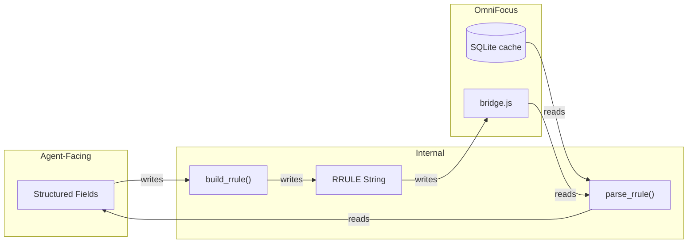

# Architecture Overview

## Layer Diagram

```
MCP Tools (get_all, get_task, get_project, get_tag, add_tasks, edit_tasks)
    |
OperatorService              -- validation, parent/tag resolution, delegation
    |
Repository (protocol)        -- async reads + writes -> AllEntities, Task, etc.
    |
    +-- HybridRepository     (production: SQLite reads + Bridge writes)
    +-- BridgeRepository     (fallback: Bridge for both reads and writes)
    +-- InMemoryRepository   (testing: in-memory snapshot, synthetic writes)
```

## Package Structure

```
omnifocus_operator/
    bridge/          -- OmniFocus communication (IPC, in-memory, simulator)
    repository/      -- Data access protocol + implementations + factory
    models/          -- Pydantic models (entities, enums, read/write specs)
    simulator/       -- Mock OmniFocus simulator for IPC testing
    server.py        -- FastMCP tool registration + wiring
    service.py       -- Validation, resolution, delegation to repository
```

## Dumb Bridge, Smart Python

The most important architectural invariant: **the bridge is a relay, not a brain**. All validation, resolution, diff computation, and business logic lives in Python. The bridge script receives pre-validated payloads and executes them without interpretation.

### Why

- **OmniJS freezes the UI.** Every line of bridge logic is user-visible latency — scanning 2,825 tasks takes ~1,264ms during which OmniFocus is unresponsive
- **OmniJS is quirky.** Opaque enums, unreliable batch operations, null rejection — the runtime has sharp edges that are painful to debug
- **Python is testable.** 534 pytest tests cover service logic, adapter transformations, and repository behavior. Bridge.js has 26 Vitest tests for basic relay correctness — that's the right ratio
- **Python is typed.** Pydantic models, mypy strict mode, and structured error handling catch issues at development time, not at 7:30am in production

### Known OmniJS Quirks

These are concrete examples of why logic stays out of the bridge:

- **`removeTags(array)` is unreliable** — bridge works around this by removing tags one at a time in a loop instead of batch (`bridge.js`, `handleEditTask`)
- **`note = null` is rejected** — OmniFocus API requires empty string to clear notes. Service maps `null -> ""` before bridge sees it (`service.py`, `_build_edit_payload`)
- **Enums are opaque objects** — `.name` returns `undefined`. Only `===` comparison against known constants works. Bridge does minimal enum-to-string resolution and throws on unknowns (`bridge.js`, enum resolvers)
- **Same-container moves are no-ops** — `beginning`/`ending` moves within the same container don't reorder. Service detects this and warns with a workaround (`service.py`, `_process_move`)
- **Blocking state is invisible** — bridge cannot determine sequential dependencies or parent-child blocking. Only SQLite has full availability data (`BRIDGE-SPEC.md:FALL-02`)

### What Lives Where

| Concern | Where | Why |
|---------|-------|-----|
| Enum-to-string resolution | Bridge | Must happen at source (opaque objects) |
| Tag name-to-ID resolution | Service | Case-insensitive matching, ambiguity errors |
| Tag diff computation | Service | Minimal add/remove sets, no-op warnings |
| Cycle detection (moves) | Service | Parent chain walk on cached snapshot — instant |
| No-op detection + warnings | Service | Field comparison before bridge delegation |
| Null-means-clear mapping | Service | Business logic, not transport |
| RRULE string generation | Service | Structured fields → RRULE string (see [RRULE Utility Layer](#rrule-utility-layer)) |
| Lifecycle (complete/drop) | Service + Bridge | Service validates state, bridge executes `markComplete()`/`drop()` |
| Validation (all of it) | Service | Three layers, all before bridge call |

### The Result

The bridge is ~400 lines of trivial relay code. The rest of the project is ~14,000 lines of validated, typed, tested Python. That's the right split.

## Repository Protocol

Structural typing (no inheritance required). Current contract:

- `get_all()` -> `AllEntities` -- full snapshot (tasks, projects, folders, tags)
- `get_task(id)` / `get_project(id)` / `get_tag(id)` -> single entity or None
- `add_task(spec, resolved_tag_ids)` -> `TaskCreateResult`
- `edit_task(spec, ...)` -> `TaskEditResult`

Three implementations: HybridRepository (production), BridgeRepository (fallback), InMemoryRepository (tests).

## Method Naming Convention

- `get_all()` -> `AllEntities`: structured container with all entity types
- `get_*` by ID -> single entity lookup
- `list_*(filters)` -> flat list of one entity type (e.g., `list_tasks(status=...)`) -- planned for v1.3
- `add_*` / `edit_*` -> write operations
- `get_*` = heterogeneous structured return; `list_*` = homogeneous filtered collection
- `AllEntities` (not `DatabaseSnapshot`) -- no caching/snapshot semantics at the protocol level

## Why Repository, Not DataSource

- Repository implies querying/filtering -- `list_tasks(filters)` in v1.3
- DataSource implies raw data access -- too thin an abstraction
- Repository is the richer contract for how consumers interact with data

## Why Flat Packages (bridge/ and repository/ as peers)

- Bridge is a general OmniFocus communication channel, not just data access
- Future milestones: perspective switching, UI actions -- all via Bridge directly
- Write operations go through Bridge (repository delegates)
- `repository/` depends on `bridge/` (never reverse)
- Keeping them as siblings avoids false nesting (`repository/bridge/` would imply ownership)

## Dependency Direction

- `service.py` -> `Repository` protocol (never concrete implementations)
- `server.py` -> concrete `HybridRepository` + `BridgeRepository` + `Bridge` + `MtimeSource` (wiring only)
- `repository/hybrid.py` -> `bridge/` package (Bridge for writes, SQLite for reads)
- `repository/bridge.py` -> `bridge/` package (Bridge protocol, MtimeSource, adapter)
- `repository/in_memory.py` -> `models/` only (zero bridge dependency)

## Caching & Read Path

- **HybridRepository** (default, primary read path): SQLite cache (~46ms full snapshot, OmniFocus not required)
  - WAL-based freshness detection: 50ms poll, 2s timeout after writes
  - No caching layer on top -- 46ms is fast enough
  - Marks stale after writes; next read waits for fresh WAL mtime
- **BridgeRepository** (fallback via `OMNIFOCUS_REPOSITORY=bridge`): OmniJS bridge dump
  - mtime-based cache invalidation; checks file mtime before each read, serves cached snapshot if unchanged
  - Concurrent reads coalesce into a single bridge dump
- **InMemoryRepository** (tests): no caching (returns constructor snapshot as-is)

## Write Pipeline (v1.2)

- Writes flow: MCP Tool -> Service (validate) -> Repository -> Bridge (execute) -> invalidate cache
- Service validates before bridge execution: task/parent exists, tags exist, name non-empty
- Tag resolution in service: case-insensitive name match, ID fallback, ambiguity error with IDs
- Parent resolution in service: try `get_project` first, then `get_task` -- **project takes precedence** (intentional, deterministic)
- Bridge returns minimal result; service wraps into typed result model
- HybridRepository marks stale after write; BridgeRepository clears cache

## Patch Semantics (edit_tasks)

- Three-way field distinction: omit = no change, null = clear, value = set

  ```json
  {
    "id": "abc123",
    "name": "New name",      // value → set
    "dueDate": null,         // null  → clear
                             // note  → omitted, no change
  }
  ```

- Pydantic sentinel pattern (UNSET) distinguishes "not provided" from "explicitly null"
- Clearable fields: dates, note, estimated_minutes. Value-only: name, flagged
- Bridge payload only includes non-UNSET fields; bridge.js uses `hasOwnProperty()` to detect presence

## Task Movement (actions.move)

"Key IS the position" design — the move object has exactly one key:

```json
{"move": {"ending": "proj-123"}}       -- last child of container
{"move": {"beginning": "proj-123"}}    -- first child of container
{"move": {"after": "task-sibling"}}    -- after this sibling (parent inferred)
{"move": {"before": "task-sibling"}}   -- before this sibling (parent inferred)
{"move": {"beginning": null}}          -- move to inbox
```

- Lives under `actions.move` in the edit spec (see [Field Graduation Pattern](#field-graduation-pattern))
- One key = one position + one reference. Invalid combos are structurally impossible.
- Maps directly to OmniJS position API: `container.beginning`, `container.ending`, `task.before`, `task.after`
- Full cycle validation via SQLite parent chain walk before bridge call

## Educational Warnings

- Write results include optional `warnings` array for no-ops and edge cases
- Design principle: LLMs learn in-context from tool responses, so warnings serve as runtime documentation
- Examples:
  - Tag no-op: "Tag 'X' was not on this task — omit remove_tags to skip"
  - Setter no-op: "Field 'flagged' is already true — omit to skip"
  - Same-container move: "Task is already in this container. Use 'before' or 'after' with a sibling task ID to control ordering."
  - Lifecycle on completed: "Task is already completed — no change made"

## Field Graduation Pattern

The edit API separates **setters** (top-level fields) from **actions** (operations that modify state):

```json
{
  "id": "xyz",
  "name": "Renamed",        // setter -- simple field replacement
  "flagged": true,           // setter
  "actions": {               // actions -- operations with richer semantics
    "tags": { "add": [...], "remove": [...] },   // or "replace": [...]
    "move": { "after": "sibling-id" },
    "lifecycle": "complete"
  }
}
```

Design principles:
- **Setters** are idempotent field replacements (top-level). Generic no-op warning when value unchanged.
- **Actions** are operations that modify relative to current state (nested under `actions`). Action-specific warnings (e.g., "Tag 'X' is already on this task").
- **Any field can graduate** from setter to action group when it needs more than simple replacement.
  - Migration path:
    1. Remove the field from top-level setters
    2. Add it as an action group under `actions` with `replace` + new operations
  - Example: `note` could graduate to `actions.note: { replace: "...", append: "..." }` when append-note is needed.
- **Tags are the first graduated field:**

  ```json
  // Before graduation (v1.2.0): top-level setter, replace-only
  { "tags": ["Work", "Planning"] }

  // After graduation (v1.2.1): action group with add/remove/replace
  { "actions": { "tags": { "add": ["Urgent"], "remove": ["Planning"] } } }
  ```

- **Each graduation is independent** — migrate one field at a time as use cases emerge.

## Two-Axis Status Model

- Urgency: `overdue`, `due_soon`, `none` -- time-based, computed from dates
- Availability: `available`, `blocked`, `completed`, `dropped` -- lifecycle state
- Replaces single-winner status enum from v1.0; matches OmniFocus internal representation

## Repetition Rule: Structured Fields, Not RRULE Strings

> **Status:** Spec for Phase 18 — not yet implemented. The current read model still exposes raw `rule_string`, `schedule_type`, and `anchor_date_key` fields. This section describes the target architecture.

Agents never see RRULE strings. The read and write models expose repetition as structured, type-discriminated fields. The RRULE string is an internal serialization detail between the service layer and the bridge.

Why top-level (not inside `actions`): setting a repetition rule is idempotent — same input always produces the same result, regardless of current state. Follows the same pattern as `due_date`, `note` — set, clear, or leave unchanged.

### Repetition Rule Structure

```
repetitionRule
├── frequency                    -- nested, type-discriminated
│   ├── type                     -- discriminator (required)
│   ├── interval                 -- every N of that type (default: 1)
│   └── onDays / on / onDates    -- type-specific (see below)
├── schedule                     -- "regularly" | "regularly_with_catch_up" | "from_completion"
├── basedOn                      -- "due_date" | "defer_date" | "planned_date"
└── end                          -- optional: {"date": "ISO-8601"} or {"occurrences": N}
```

- `schedule` — three values; collapses scheduleType + catchUpAutomatically into one field
- `basedOn` — renamed from anchorDateKey to match OmniFocus UI language ("based on due date"). See [OmniFocus Concepts](omnifocus-concepts.md#dates) for date semantics
- `end` — "key IS the value" pattern (same as [actions.move](#task-movement-actionsmove)): exactly one key, omit for no end
- `frequency.interval` — nested (tightly coupled with type: "every 2 weeks" is one concept)

### Frequency Types

Eight types, with `type` as the Pydantic discriminator:

| Type | Day field | Example |
|------|-----------|---------|
| `minutely` | — | Every 30 minutes |
| `hourly` | — | Every 2 hours |
| `daily` | — | Every 3 days |
| `weekly` | `onDays`: `string[]` — two-letter codes (MO–SU), optional | Every 2 weeks on Mon, Fri |
| `monthly` | — | Every month (from basedOn date) |
| `monthly_day_of_week` | `on`: `object` — single `{ordinal: dayName}` | The 2nd Tuesday of every month |
| `monthly_day_in_month` | `onDates`: `int[]` — day numbers (1–31, -1 = last) | The 1st and 15th of every month |
| `yearly` | — | Every year |

Each frequency type that needs day specification uses a **type-specific field name** — no polymorphism:

```json
// weekly → onDays: array of two-letter day codes (case-insensitive, normalized to uppercase)
"onDays": ["MO", "WE", "FR"]

// monthly_day_of_week → on: single key-value object (reads like English: "on the second Tuesday")
// Keys: first, second, third, fourth, fifth, last
// Values: monday–sunday, weekday, weekend_day (case-insensitive, normalized to lowercase)
"on": {"second": "tuesday"}

// monthly_day_in_month → onDates: array of integers (1–31, -1 for last day)
"onDates": [1, 15, -1]
```

### Examples

**Daily** — every 3 days, from completion, based on defer date:
```json
{
  "repetitionRule": {
    "frequency": { "type": "daily", "interval": 3 },
    "schedule": "from_completion",
    "basedOn": "defer_date"
  }
}
```

**Weekly** — every 2 weeks on Mon and Fri, regularly with catch-up, based on due date:
```json
{
  "repetitionRule": {
    "frequency": { "type": "weekly", "interval": 2, "onDays": ["MO", "FR"] },
    "schedule": "regularly_with_catch_up",
    "basedOn": "due_date"
  }
}
```

**Monthly (nth weekday)** — the last Friday of every month, stop after 12 occurrences:
```json
{
  "repetitionRule": {
    "frequency": { "type": "monthly_day_of_week", "interval": 1, "on": {"last": "friday"} },
    "schedule": "regularly",
    "basedOn": "due_date",
    "end": { "occurrences": 12 }
  }
}
```

**Monthly (specific days)** — the 1st and 15th of every month, until a date:
```json
{
  "repetitionRule": {
    "frequency": { "type": "monthly_day_in_month", "interval": 1, "onDates": [1, 15] },
    "schedule": "regularly_with_catch_up",
    "basedOn": "planned_date",
    "end": { "date": "2026-12-31" }
  }
}
```

**Clear** — standard patch semantics: `"repetitionRule": null`

### Partial Update Semantics

Repetition rules support targeted partial updates on `edit_tasks`, following two rules:

1. **Root-level fields are independently updatable** — change `schedule`, `basedOn`, or `end` without resending other fields
2. **Frequency object uses type as the merge boundary:**
   - Same type → merge (omitted fields preserved from existing rule)
   - Type changes → full replacement required (no cross-type inference)
   - `type` is always required in the frequency object

```json
// Change only basedOn (everything else preserved):
{ "repetitionRule": { "basedOn": "defer_date" } }

// Add Friday to existing weekly schedule (interval preserved):
{ "repetitionRule": { "frequency": { "type": "weekly", "onDays": ["TH", "FR"] } } }

// Switch from weekly to monthly (full frequency object required):
{ "repetitionRule": { "frequency": { "type": "monthly_day_in_month", "interval": 1, "onDates": [15] } } }
```

No existing rule + partial update → error: "Task has no repetition rule. Provide a complete rule."

### RRULE Utility Layer

Standalone functions bridge the structured API and the internal RRULE format:




#### Write Path

- `build_rrule(FrequencySpec) -> str` — structured model to RRULE string
- Service layer calls `build_rrule()` then sends the RRULE string + metadata to bridge.js
- Bridge stays dumb — receives `(ruleString, scheduleType, anchorDateKey, catchUp)`, creates `new Task.RepetitionRule()`

#### Read Path

- `parse_rrule(str) -> FrequencySpec` — RRULE string to structured model
- Both read paths (SQLite and bridge adapter) call `parse_rrule()` — single parsing implementation, two call sites
- All parsing in Python, not bridge — see [Dumb Bridge, Smart Python](#dumb-bridge-smart-python)

#### Common

- Both functions accept/return Pydantic models, not dicts

### Validation Layers

Three layers, all before bridge execution:

1. **Pydantic structural** — required fields, enum values, `end` has exactly one key
2. **Type-specific constraints** — reject fields that don't belong to given frequency type; value ranges (interval >= 1, valid day codes, valid ordinals, dayOfMonth -1 to 31 excluding 0)
3. **Service semantic** — no existing rule + partial update, type change + incomplete frequency, no-op detection with educational warnings

## Deferred Decisions

- Multi-repository coordination in OperatorService (if needed)
