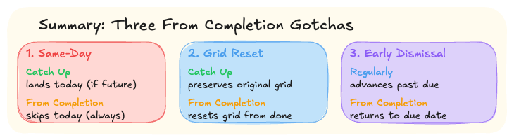

# OmniFocus Concepts

Concepts that matter for understanding the OmniFocus Operator API. This is not an OmniFocus manual — it covers only the concepts that affect how agents should interact with the server.

## Dates

OmniFocus has three date fields. They serve fundamentally different purposes and should never be conflated.

### Due Date

A real-world deadline with negative consequences if missed.

The consequence doesn't have to be catastrophic — it ranges from severe (contract expires, legal deadline) to soft (a relationship suffers because you didn't reply within a reasonable window). What makes it a due date is that **missing it has a real, tangible downside**.

**Not a due date:** "I want to clean the living room on Tuesday." If Wednesday works just as well, there's no deadline — there's no negative consequence for missing Tuesday. Setting this as a due date pollutes the urgency signal.

**A due date:** "Reply to Sarah about dinner plans by Friday." If you don't, the relationship takes a small hit. That's a real consequence, even if minor.

**Why this matters:** The moment you start using due dates for intentions ("I'd like to do this by..."), every task becomes "due," nothing stands out, and you lose the urgency signal entirely. Due dates should trigger a sense of "this must happen by then" — reserve them for exactly that.

### Defer Date

The task is **impossible to act on** until this date. Not "I don't want to work on it yet" — literally cannot.

**Example:** Your flat contract renewal window opens 2 months before the lease ends. You physically cannot renew before that window opens. The task is deferred to that date because acting on it earlier is impossible.

**Behavior:** Deferred tasks disappear from most OmniFocus views until the defer date arrives. This is by design — if you can't act on it, you shouldn't see it. When the date arrives, the task reappears and becomes available.

**Not a defer date:** "I don't feel like working on this until next week." If you _could_ work on it now but choose not to, that's not a deferral — you'd be hiding a task you might actually want to see. Use planned date instead.

### Planned Date

"I wish I worked on this on that date."

Fills the gap between due (too urgent — implies negative consequences) and defer (too hidden — removes from view):

- **No urgency signal** — won't turn red or yellow as it approaches
- **Task stays visible** — unlike defer, the task remains in your views before the planned date
- **Pure intention** — signals when you'd like to work on it, with no penalty for missing it

**Example:** "I'd like to review the Q3 roadmap on Thursday." No consequence if you do it Friday. You still want to see it before Thursday in case you get to it early. Not urgent, not blocked — just planned.

**Power use:** Combined with custom OmniFocus perspectives, planned dates enable sophisticated workflows — filtering by "planned for this week," sorting by planned date within a project, etc.

### Summary

| Field        | Meaning                 | Consequence of missing    | Visibility before date   |
| ------------ | ----------------------- | ------------------------- | ------------------------ |
| Due date     | Must happen by then     | Real negative consequence | Visible, urgency signals |
| Defer date   | Cannot act until then   | N/A (impossible before)   | Hidden from most views   |
| Planned date | Want to work on it then | None                      | Visible, no urgency      |

**The rule:** Due dates are for deadlines. Defer dates are for constraints. Planned dates are for intentions. If you're unsure which to use, it's probably a planned date.

## Repetition Rules

OmniFocus tasks and projects can repeat. A repetition rule has three components: **frequency** (how often), **schedule** (what triggers the next occurrence), and **basedOn** (which date field anchors the schedule).

### Based On (Anchor Date)

The anchor date determines which date field the repetition schedule attaches to. When the next occurrence is generated, the anchor date moves to the scheduled date. **All other date fields shift relatively, preserving their current offset from the anchor.**

**Example:** A task repeats on the 15th of every month. The anchor is `planned_date`. Currently:

- Planned date: March 15
- Due date: March 18 (+3 days from anchor)
- Defer date: March 10 (−5 days from anchor)

When the next occurrence is generated:

- Planned date → April 15 (the scheduled date)
- Due date → April 18 (anchor + 3 days, offset preserved)
- Defer date → April 10 (anchor − 5 days, offset preserved)

| Value          | Meaning                               |
| -------------- | ------------------------------------- |
| `due_date`     | Schedule anchored to the due date     |
| `defer_date`   | Schedule anchored to the defer date   |
| `planned_date` | Schedule anchored to the planned date |

**The rule:** Choose the date that the recurrence is "about." If a task is due every Friday, anchor on `due_date`. If it becomes available every Monday, anchor on `defer_date`. If you just want to plan it for the same day each week, anchor on `planned_date`.

> **What happens when the anchor date field is not set on the task?** OmniFocus creates the missing anchor date from scratch on the next occurrence: it takes the **completion date** and applies the user's **default time** for that date type (configured in OmniFocus Settings → Dates & Times). This produces a valid but potentially surprising schedule — set the anchor date explicitly for predictable behavior. See [omnifocus-repetition-behavior.md](../.research/deep-dives/repetition-modes/omnifocus-repetition-behavior.md), Part 7 for the full empirical verification.

### Schedule (Recurrence Mode)

The schedule controls what happens when a task is completed — specifically, how the next occurrence's date is calculated.

| Mode                      | How the next date is calculated                                     |
| ------------------------- | ------------------------------------------------------------------- |
| 🔄 `regularly`               | Next on the schedule after the assigned date — can land in the past |
| ✅ `regularly_with_catch_up` | Next on the schedule that's still in the future                     |
| ⚠️ `from_completion`         | Next occurrence counting forward from when you complete             |

> **When completed on time**, all three modes produce the same result. The differences only matter when you're late (or early).

#### Choosing a mode

- ✅ Task must happen on **specific calendar days** regardless of completion history → **`regularly_with_catch_up`** (recommended default)
- 🔄 Must process **every missed occurrence** individually → **`regularly`**
- ⚠️ The **minimum gap** between occurrences matters more than the specific day → **`from_completion`**

#### BYDAY edge cases

When `from_completion` is combined with day-of-week patterns (e.g. "every WE + FR"), it produces counterintuitive results in three scenarios:

- ⚡ **Same-day eligibility** — `catch_up` can land on today if the due time is still in the future; `from_completion` skips today entirely, no matter how many hours remain. Can create a **5-day gap**.
- 🤯 **Grid reset** (`INTERVAL ≥ 2`) — `catch_up` preserves the original biweekly/monthly grid; `from_completion` resets the grid from the completion date. Can create a **14+ day gap**.
- 😤 **Early completion dismissal** — completing a task early with `from_completion` can land right back on the original due date, as if the early effort didn't count.

See [BYDAY Edge Cases](byday-edge-cases.md) for the full breakdown with diagrams. For the raw empirical data, see [omnifocus-repetition-behavior.md](../.research/deep-dives/repetition-modes/omnifocus-repetition-behavior.md).
