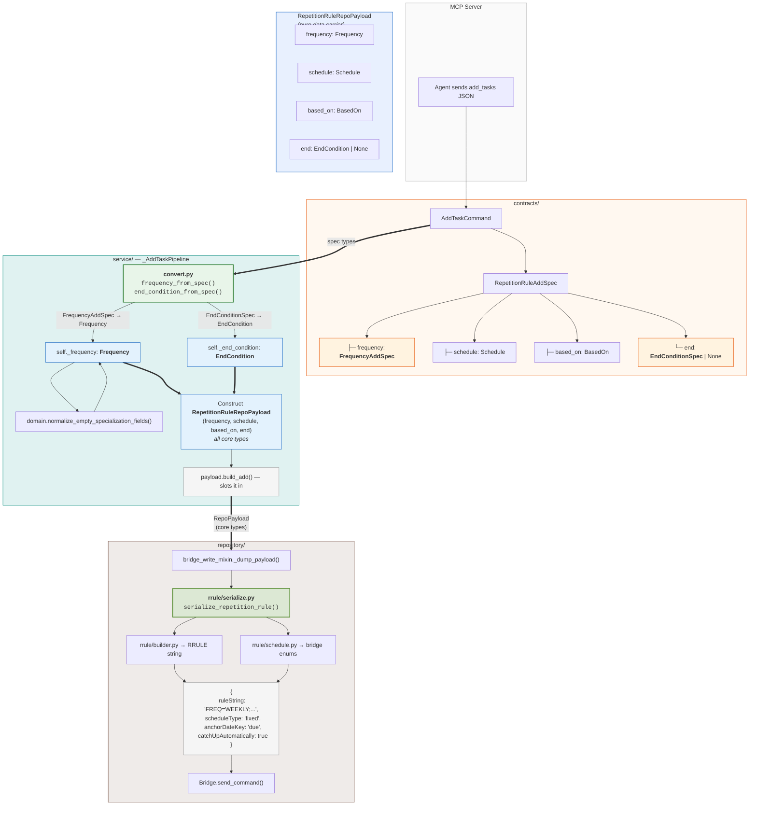
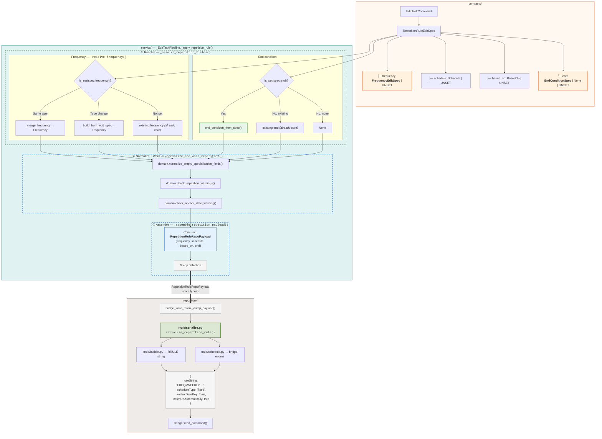
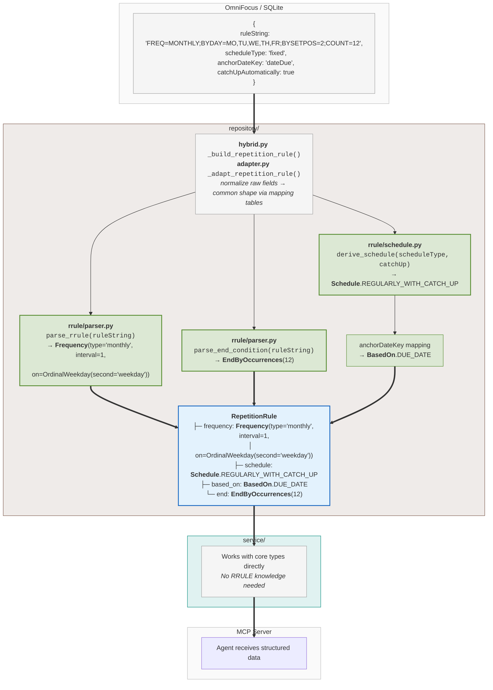
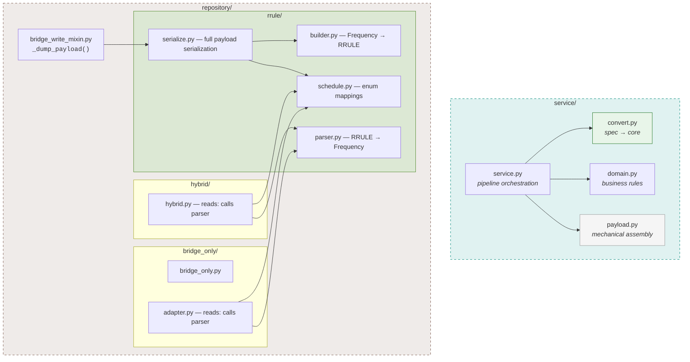

# Repetition Rule Flow — Current Architecture

## Write Path: Add Pipeline

## Write Path: Edit Pipeline

## Read Path

The mirror image of the write paths above. The same `repository/rrule/` package that serializes core types to RRULE on writes also parses RRULE back to core types on reads. Both read implementations (hybrid SQLite, bridge-only adapter) converge on the same `rrule/` functions.

## Package Structure

## Color Legend

| Color | Meaning |
|-------|---------|
| **Orange** | Spec types (contract layer, write-side input) |
| **Blue** | Core types (model layer, domain truth) |
| **Green** | Service-layer conversion (spec → core) |
| **Sage** | Repository-layer translation (core ↔ RRULE/bridge format) |
| **Grey** | Mechanical / pass-through (no transformation) |

### Subgraph Backgrounds

Consistent across all diagrams — the background tint identifies the architectural layer:

| Background | Layer |
|------------|-------|
| Light orange | `contracts/` |
| Light teal | `service/` |
| Warm tan | `repository/` |
| Light blue | Core type carriers (RepoPayload) |
| Neutral grey | External boundaries (MCP Server, OmniFocus) |
