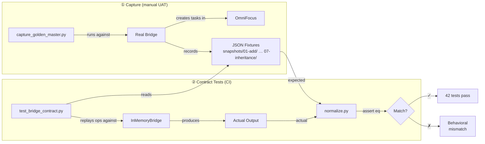

# Golden Master

Bridge contract test infrastructure for proving InMemoryBridge behavioral equivalence with the real Bridge.

## Contents

- `normalize.py` -- Normalization and filtering helpers for comparison
  - `normalize_for_comparison()` -- strip dynamic fields, apply presence-check sentinels
  - `normalize_response()` -- strip `id` from write responses
  - `normalize_state()` -- normalize + sort an entire state snapshot
  - `filter_to_known_ids()` -- filter `get_all` to test-created entities only
- `snapshots/` -- Captured golden master fixtures (nuked and regenerated on each capture)
  - `initial_state.json` -- Seeded state before scenarios (3 projects, 2 tags)
  - `01-add/` through `07-inheritance/` -- Numbered subfolders, sorted = execution order
  - Each subfolder contains numbered scenario JSON files

## Subfolder Layout

```
snapshots/
  initial_state.json
  01-add/        (6 scenarios: inbox, parent, all fields, tags, parent+tags, max payload)
  02-edit/       (11 scenarios: rename, note, clear, flag, dates, estimate, planned)
  03-move/       (7 scenarios: ending, inbox, beginning, after, before, cross-project, task-parent)
  04-tags/       (5 scenarios: add, remove, replace, duplicate, absent)
  05-lifecycle/  (4 scenarios: complete, drop, defer-blocked, clear-defer)
  06-combined/   (3 scenarios: fields+move, fields+lifecycle, subtask+move)
  07-inheritance/ (7 scenarios: due, flagged, chain, defer, deep nesting 3 levels)
```

## Regeneration

```bash
uv run python uat/capture_golden_master.py
```

Per GOLD-01: regenerate when bridge operations change (new commands, field additions, behavioral modifications).

## How It Works



1. **Capture** (manual UAT): `capture_golden_master.py` runs against the real Bridge, creates test entities in OmniFocus, records responses and state snapshots as JSON fixtures in numbered subfolders.
2. **Contract tests** (CI): `test_bridge_contract.py` discovers subfolders in sort order, replays the same operations against InMemoryBridge, and asserts structural equivalence after normalizing dynamic fields.

## Field Normalization

- **VOLATILE** fields (id, url, added, modified): stripped entirely -- differ every run
- **PRESENCE_CHECK** fields (completionDate, dropDate, effectiveCompletionDate, effectiveDropDate): non-null values normalized to `"<set>"` sentinel
- **UNCOMPUTED** fields (status): stripped -- InMemoryBridge doesn't compute these
- All other fields: exact match between golden master and InMemoryBridge output
